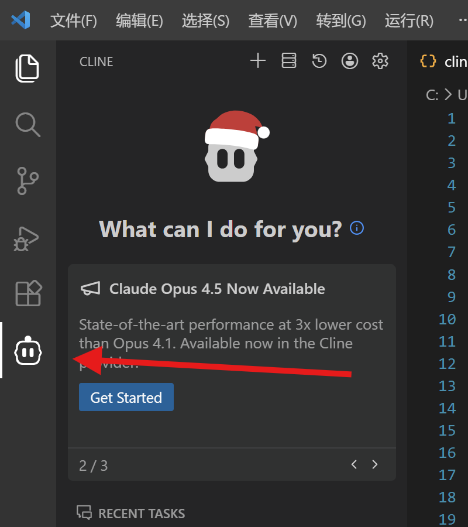
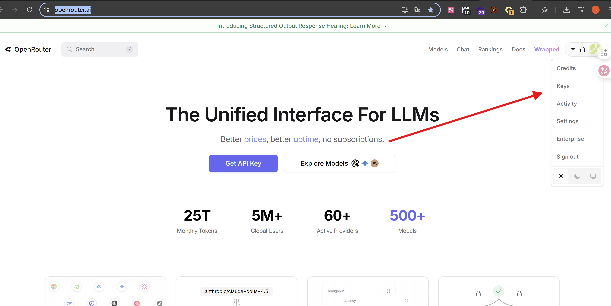
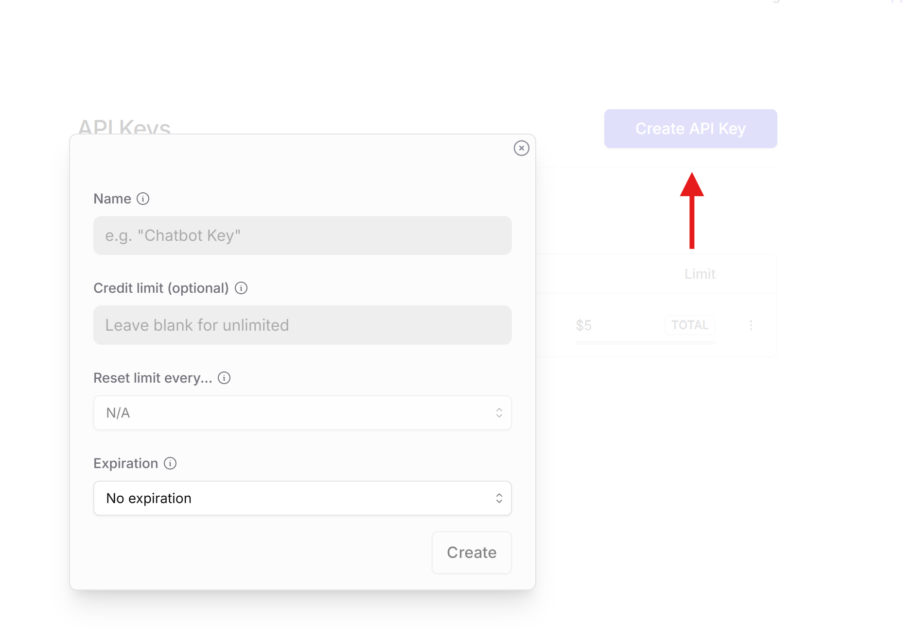
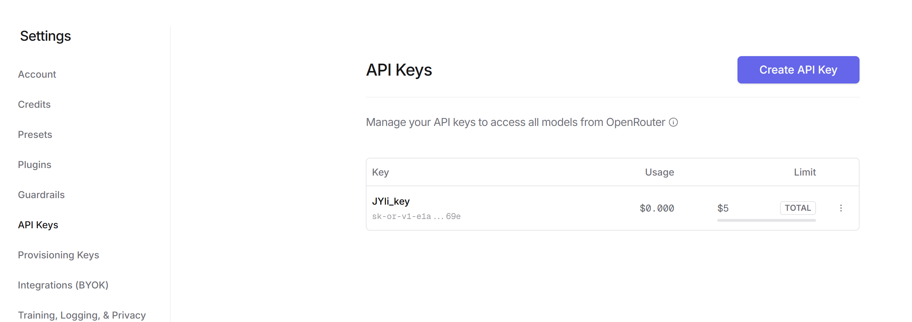
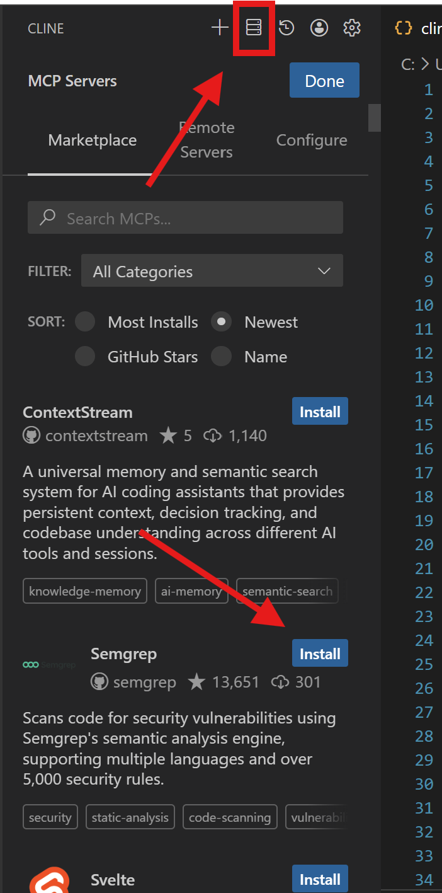
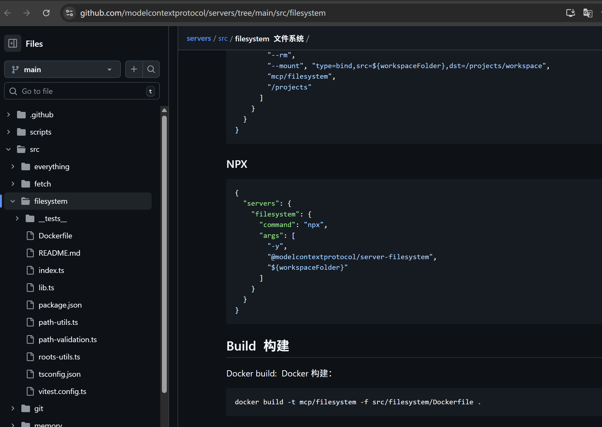
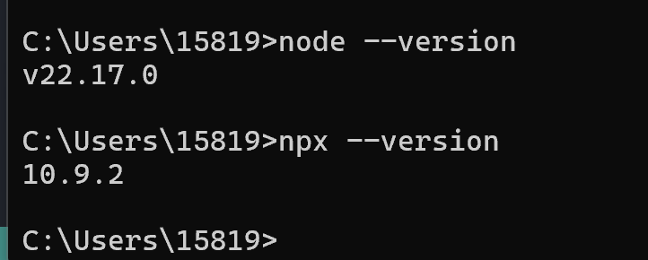

## 0x01 简介

模型上下文协议（MCP）是一个创新的开源协议，它重新定义了大语言模型（LLM）与外部世界的互动方式。MCP 提供了一种标准化方法，使任意大语言模型能够轻松连接各种数据源和工具，实现信息的无缝访问和处理。MCP 就像是 AI 应用程序的 USB-C 接口，为 AI 模型提供了一种标准化的方式来连接不同的数据源和工具。
简单说就是，大模型是大脑，负责思考，那就可通过mcp协议调用mcp-server实现一些操作，例如对你本地文件进行操作。

这里也是简单学习了一下mcp的使用，结合实例记录一下吧：
首先了解两个东西
### 1.1 mcp host（claude、vscode-cline）
运行LLM的应用程序（如Claude Desktop），负责发起与MCP服务器的连接。
就是一个我们与大模型之间的桥梁，我们通过`mcp host`给大模型发送我们的需求，大模型又用过`mcp host`调用`mcp server`去实现一些操作

### 1.2 mcp server
提供对外部数据源和工具的访问，响应客户端的请求。
就是相当于一些接口，每个`mcp server`都有很多`tool`，
这些`tool`就相当于一个个函数（比如获取文件信息，删除文件等）

下面我们来实际使用一下：

## 0x02 使用

### 2.1 MCP host配置
我们这里使用`vscode-cline`作为我们的host

首先下载vscode的cline插件：

下载后出现这个，这就是cline的操作页面，接下来我们要去配置一个大模型（我们用的是免费的deepseekR1）

### 2.2 大模型配置
可以去各个官网获取API-key。
或者在集成网站：
https://openrouter.ai/ ，上面有很多的大模型，价格和官网差不太多，还有一些免费的模型
1. 先注册
2. 然后点这里

3. 然后点Creat，会出现这个（这里name随便填，下面这个是最多一次用多少余额，不太要管，也可以设置一个5吧，最下面两个就默认就好了）

4. 随后会出现一个API-key，这个key记下来，后面就看不到了。
5. 然后这里操作就基本结束了，但是要使用付费大模型的话还得去左边`Credits`页面充点钱（如何操作可以参考文章
https://zhuanlan.zhihu.com/p/1898753591528908109 ）

### 2.3 配置MCP server
我们这里使用`filesystem作为我们的mcp server`（是一个操作本地文件的server）

下载方式可以选择直接在插件市场里面安装，然后按照提示弄，（本质上是ai帮你弄）

如果我们想自己弄可以选择点击这个插件，会进入github仓库，自己看文档安装，我们这里就是这样；
到github仓库，找到使用方式

我不太会用docker搭建这种所以直接用npx了，npx是nodejs的一种类似包管理工具吧（应该有点像python 的pip）
所以得先下载nodejs，里面自带npx。

来到cline插件部分，点击`Configure MCP Servers`,会得到一份配置文件，里面是专门配置mcp的

我们把刚刚github仓库里面的json数据插入