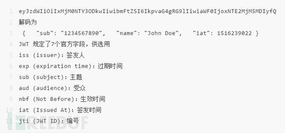
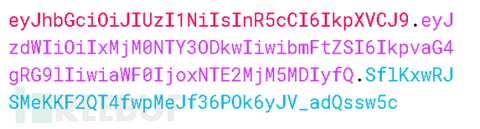
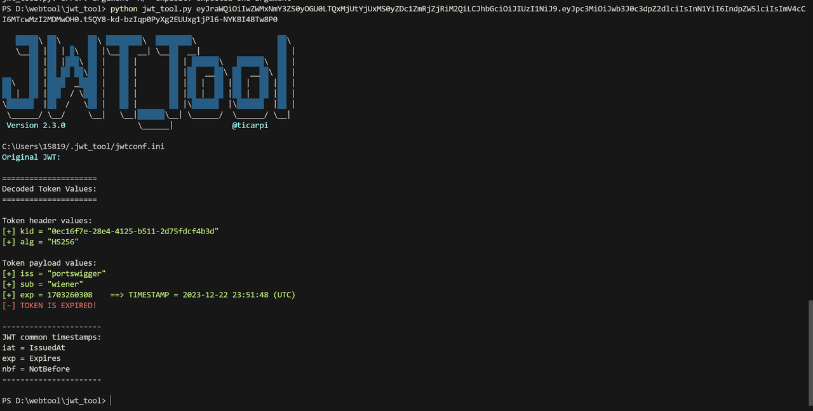
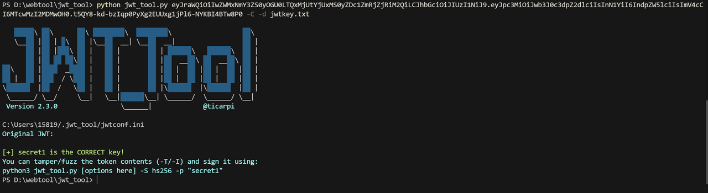

jwt包括三个部分，**header payload** **Signature（签名）**
# 0x01 JWT组成
## 1.1 header

eyJhbGciOiJIUzI1NiIsInR5cCI6IkpXVCJ9 解码为 { "alg": "HS256", "typ": "JWT" } alg属性表示签名的算法（algorithm），默认是 HMAC SHA256（写成 HS256）；typ属性表示这个令牌（token）的类型（type），JWT 令牌统一写为JWT

## 1.2 payload


## 1.3 Signature

Signature 部分是对前两部分的签名，防止数据篡改。

首先，需要指定一个密钥（secret）。这个密钥只有服务器才知道，不能泄露给用户。然后，使用 Header 里面指定的签名算法（默认是 HMAC SHA256），按照下面的公式产生签名。

```php
HMACSHA256(   base64UrlEncode(header) + "." +   base64UrlEncode(payload),   secret )
```


算出签名以后，把 Header、Payload、Signature 三个部分拼成一个字符串，每个部分之间用"点"（.）分隔，就可以返回给用户。

## 1.4 最终的到jwt字符



# 0x02 主要利用

主要是对jwt中payload的伪造例如讲用户改为administrator，在不验证签名时可以直接修改。但是一般会验证签名和前面的header payload是否对应，这时候就需要有密钥

可以使用jwt_tool来破解和利用

# 0x03 工具使用

```JavaScript
python jwt_tool.py <JWT>
```

解码器，相当于在线工具，会解读出header和payload



```JavaScript
python jwt_tool.py <JWT> -C -d <字典文件>
```

爆破JWT的密钥，之后可以用来伪造签名



[更多参数](https://github.com/ticarpi/jwt_tool/wiki/Using-jwt_tool)

# 0x04 JWT的安全问题
##  4.1 签名验证有缺陷
### 4.1.1 接受任意签名
原理：JWT库通常提供两种方法来处理令牌：一种是验证令牌，另一种只是解码令牌。例如，在Node.js的jsonwebtoken库中，有verify()和decode()方法。

> verify() 方法：用于验证令牌的签名是否有效，同时解码令牌内容。如果签名无效，该方法会抛出错误。
> 
> decode() 方法：仅用于解码令牌内容，不解密或验证签名。

有时，开发人员可能会混淆这两个方法，错误地只将传入的令牌传递给decode()方法。这样做实际上意味着应用程序没有验证签名，从而可能引入安全风险。`总的来说就是错误的用了只验证jwt信息而不会验证签名，的方法。`。

这种情况下我们只需要把`payload`部分的一些关键信息更改`（例如user改为admin）`即可
## 4.2 暴力破解密钥
也就是利用上面说的工具对jwt加密存在弱密钥的时候，可以破解密钥，从而伪造jwt签名。
## 4.3 JWT头参数注入
直接在jwt头部注入自己的密钥，让服务器使用我们写的密钥进行验证

