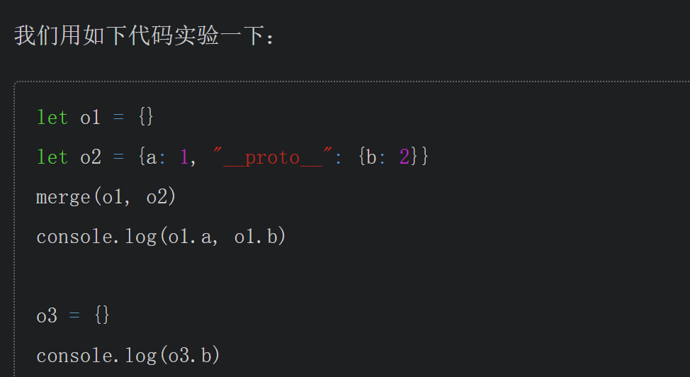
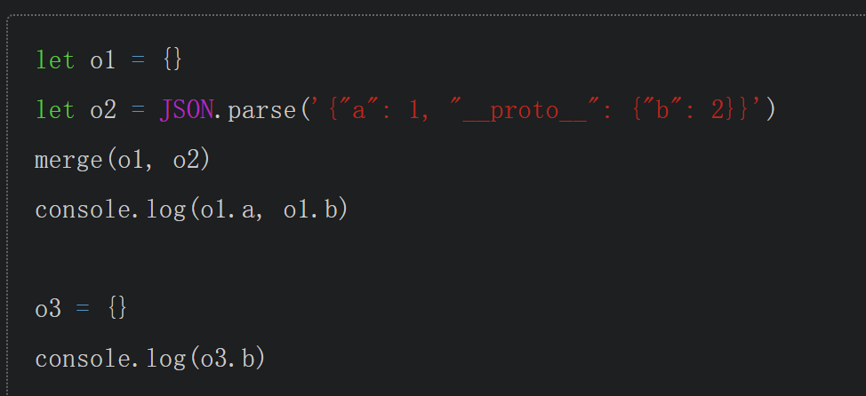

# 理解prototype和__proto__

js中定义类需要在”构造函数“里面定义，就像：

```javascript
function Foo() {
    this.bar = 1
}

new Foo()
```

他不像其他语言会单独定义一个构造函数。这就导致在有些类中需要有非法时会遇到一些问题

```javascript
function Foo() {
    this.bar = 1
    this.show = function() {
        console.log(this.bar)
    }
}

(new Foo()).show()
```

像上面这个类中有show方法，但是这样定义我们每次创建一个实例都要调用一次show方法，那有没有什么方法能够不要这样呢。这就要用到原型（prototype）的概念

```javascript
function Foo() {
    this.bar = 1
}

Foo.prototype.show = function show() {
    console.log(this.bar)
}

let foo = new Foo()
foo.show()
```

像这样，我们给Foo的原型的show方法赋值一个方法（没有的话就是创建一个），这样Foo类作为子类，自然就继承了原型的show方法，我们不需要实例化父类，所以不会一直调用，但是子类继承了父类的方法，所以在需要的时候又可以直接通过Foo.show()调用方法。这就是原型的用处。

我们可以通过Foo.prototype访问原型

但是通过实例化对象foo,就要用foo.___proto___

`foo.__proto__ == Foo.prototype`

总结：

1. prototype是类的属性，通过类直接访问
    
2. __proto__是对象的属性，通过对象访问，指向对象的类的prototype属性
    

# 绕过__proto__

constructor.prototype

# 原型链继承

js中通过不断地继承，形成一条原型链，最终都会继承到object类，而object类的prototype属性是null

# 原型链污染

通过改变一个对象原型的属性去改变该对象的属性

# 造成原型链污染的函数

以对象merge为例，我们想象一个简单的merge函数：

```javascript
function merge(target, source) {
    for (let key in source) {
        if (key in source && key in target) {
            merge(target[key], source[key])
        } else {
            target[key] = source[key]
        }
    }
}
```

和python原型链污染类似，不断递归调用，找到最里面，最后`target[key] = source[key]`赋值操作可以造成原型链污染



先这样试一下，发现并没有完成原型链污染，因为这里把__proto__当作了原型，而不是一个key



改一下之后发现污染成功，他们的差别就是后者采用了json格式，这样__proto__被解析成了key，走完了merge函数。这就是为什么原型链污染要传json格式的payload了。

# 能造成污染的函数

merge [Object.assign](https://developer.mozilla.org/zh-CN/docs/Web/JavaScript/Reference/Global_Objects/Object/assign)