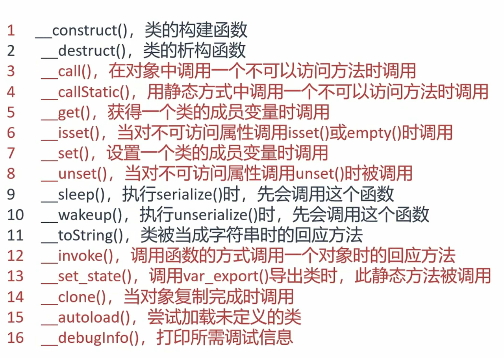
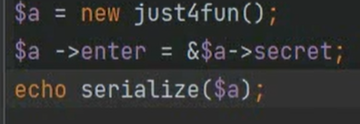
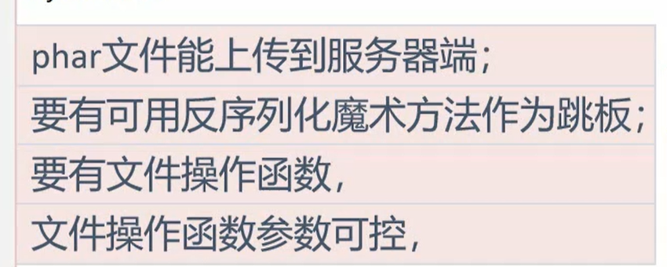
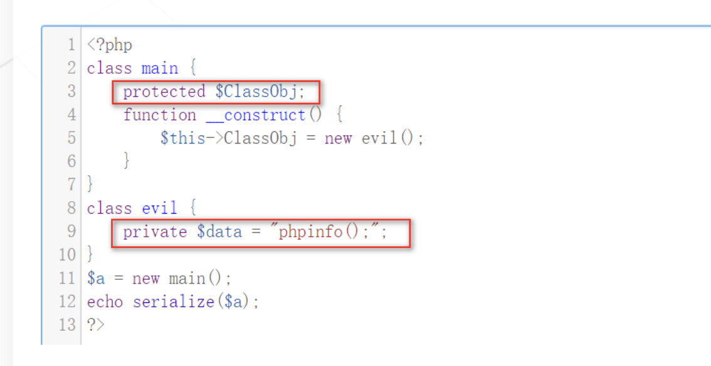

# 魔术方法

sleep：序列化之前触发，（先sleep再序列化）

wakeup：反序列化之前触发

construct：创建对象前触发

destruct：创建对象之后触发，反序列化之后也触发

toSring：把对象当作字符串调用

invoke：把对象当作函数调用时

call：调用一个不存在的方法时

callStatic：静态调用::，或者调用成员常量时使用的方法不存在

get：调用的成员属性不存在

set：给一个不存在的成员属性赋值

isset：用isset()，empty()函数访问不可访问或不存在的属性时触发

unset：对不可读的属性使用unset()函数时触发

clone：使用clone关键字拷贝对象时触发

# 给成员属性赋值类

可以利用魔术方法动态赋值，如construct（）

# wakeup绕过

将属性数量改大即可绕过

# 引用

如两个属性要相等但是其中一个属性的值会被过滤时，

表示enter的地址永远和secret相同，此时序列化后enter也不会出现过滤字符，

在php中如果我们使用 & 对变量enter的值指向变量secret，这个时候是属于浅拷贝，当变量secret改变时，变量enter也会跟着改变。在被反序列化的对象的某些变量被过滤了，但是其他变量可控的情况下，就可以利用浅拷贝来绕过过滤。

# session反序列化

默认php格式（键|序列化字符串）读取session

当php_serialize格式（直接序列化字符串）写入时，可以在前面加个|

php格式：键|值（变量名|反序列化字符串）

# phar反序列化

使用条件

- 命令执行：exec()、passthru()、popen()、system()
    
- 文件操作：file_put_contents()、file_get_contents()、unlink()
    
- 代码执行：eval()、assert()、call_user_func()
    

要给一个变量赋值一个对象时，必须使用魔术方法，不能直接赋值

要这样

  

# bypass

## 过滤O：开头

1. 用O:+4
    
2. 放入数组中