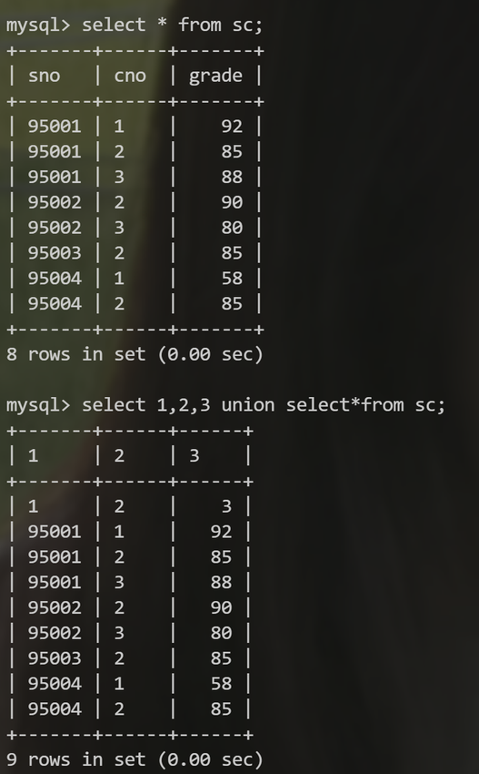
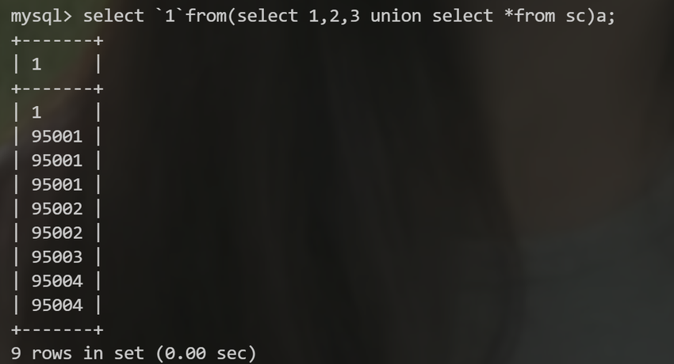
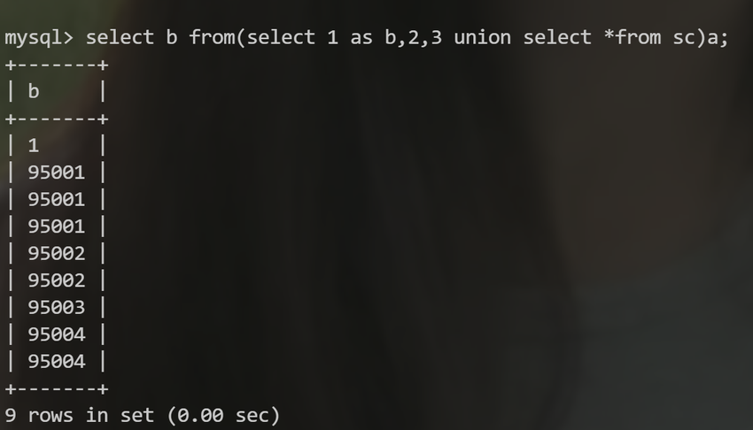
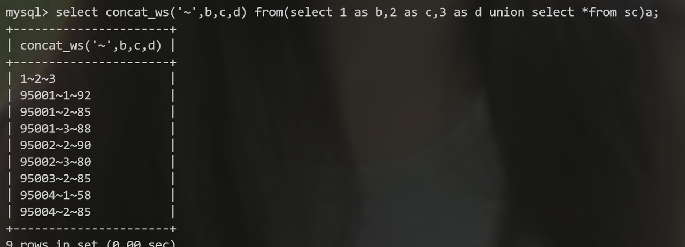

[Mysql元数据获取方法(information_schema绕过方法)](http://www.lryc.cn/news/9088.html)
## 替换绕过 information_schema.tables

* sys.schema_auto_increment_columns
* sys.schema_table_statistics_with_buffer
* x$schema_table_statistics_with_buffer（待定）
* mysql.innodb_table_stats
* mysql.innodb_table_index
以上都可以替换`information_schema.tables`
还有利用`performance_schema库中的objects_summary_global_by_type表`
```sql
SELECT object_name FROM `performance_schema`. `objects_summary_global_by_type` WHERE object_schema = DATABASE();
```
## 无列名注入
当不知道列名的时候可以通过联合查询把要查询的表和1，2，3联合起来，使列名更改



然后通过取的别名去读取每一列的内容，像这样。（末尾的a是命名，就是代表后面的查询结果命名为一个a表）



# 当 \` 被禁用

可以用as重命名代替反引号，这样不用反引号达到相同效果


同时查询多列



