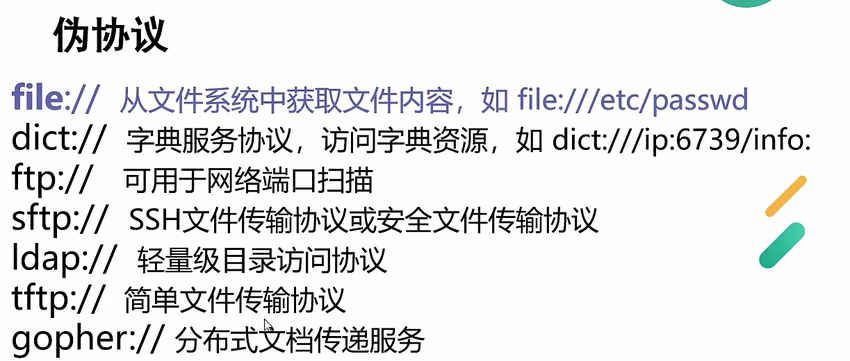
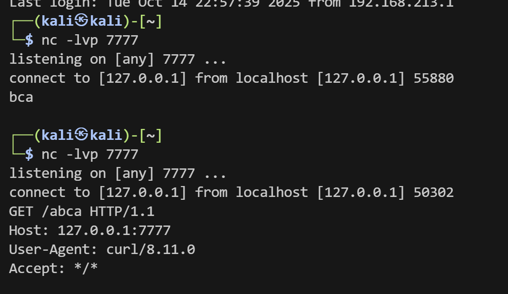
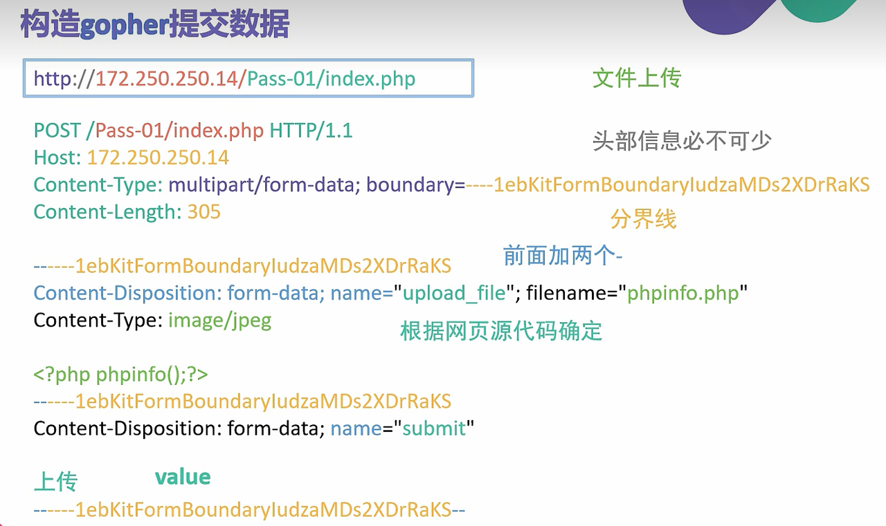

gopher 主力军

dict 测探版本信息

ftp 探测是否有ftp

http 检测是否有ssrfx

# PHP造成ssrf的函数

**curl_exec**

功能比较强大可以指定请求头

**file_get_contents,**

**sockopen**

# 常见协议



## file协议

**查看ip地址**：`file:///etc/hosts

**获取内网里面那些主机存活**: `file:///proc/net/arp(要先尝试http访问一次)`

## dict伪协议

```http
dict://<ip>:<port>/info
```

`dict://127.0.0.1:80/info用来端口扫描

## http伪协议

目录扫描

kali的/usr/share/wordlists
## 端口扫描脚本

```python
import requests

url = "http://13ba11b5-0c94-4a20-a1b9-a22db99e829f.challenges.ctfer.com:8080/"

ports = [21,22,80,443,3389,1433,3306,6379,8088]

#21 ftp

#22 ssh

#80 http

#443 https

#3389 rdp windows远程桌面

#1433 ms-sqlserver 默认端口

#3306 mysql 默认端口

#6379 redis 默认端口

#9000 php-fpm 默认端口

for p in ports:

try:

data={"url":f"gopher://127.0.0.1:{p}/"}

response = requests.post(url=url,data=data,timeout=2)

except:

print(f"端口{p}开放") #只要超时就认为开放

```


# gopher伪协议


gopher提交不提交第一个字符

gopher提交的没有其他多余的数据，但是第一个字符不会被传输



上面是用gopher传输，下面是http传输

并且默认传输到`70端口

# 用gopher发送POST，GET请求


交post包第一行，Host，Content-Type，Content-Length，内容(hader和body之间记得要有换行)

交get请求，注意最后要加一个换行

# URL绕过

进制转换，302重定向，DNS重绑定，0.0.0.0

还有一个技巧是`http://username：password@baidu.com`这样
最初是为了传递账号密码的，会解析@后面的url

# SSRF进行文件上传



提交这样的payload，这里最好用图示的Content-Type,这是在传输大量二进制流时使用的方式，它可以分块传输数据，boundary是分隔符的意思，可以自定义分隔符。

最后一样是复制下来gopher部分要url编码之后上传（用工具提交需要编码两次）

