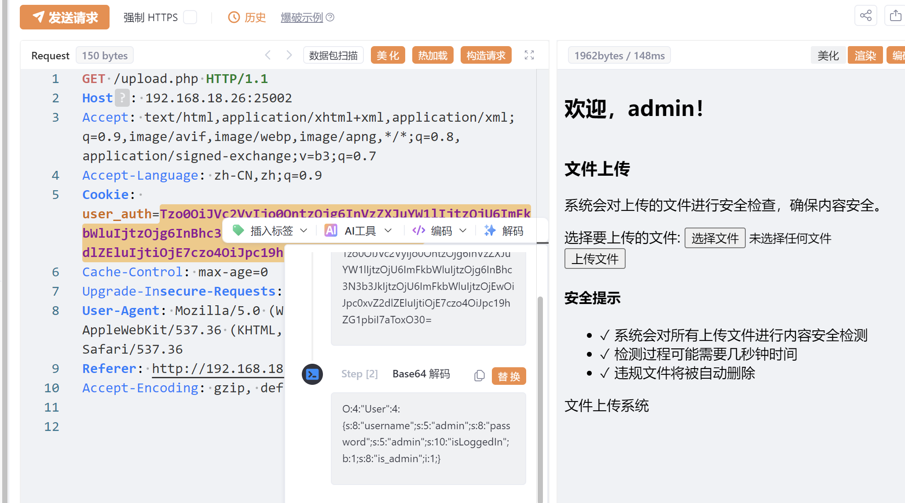
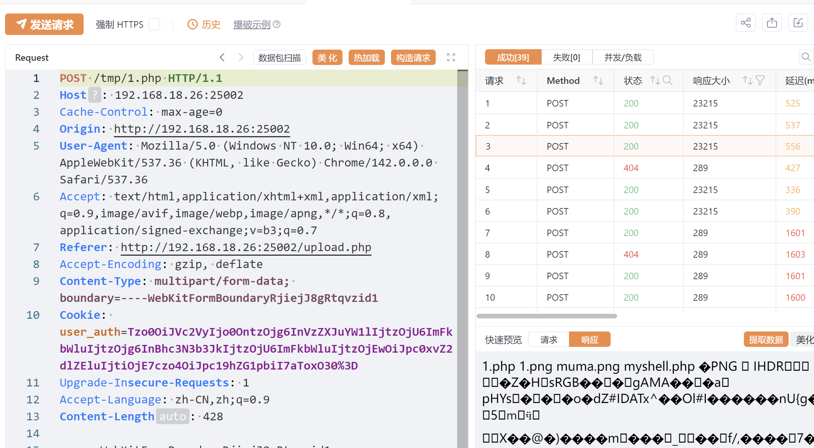
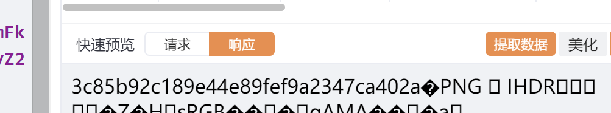

# 【pcb5-Uplssse】
注册admin，admin发现说只有admin能上传，猜测可能cookie验证，抓包

先url解码再Base64解码，发现`is_admin`为0；修改后成功进入文件上传
看到会对文件删除，就想到条件竞争，一个包上传一个包访问即可，多发几个包

可以看到也是有成功有失败的。接下来就是换成ls /和cat了
最后在`/flag6f67186d`中有flag

